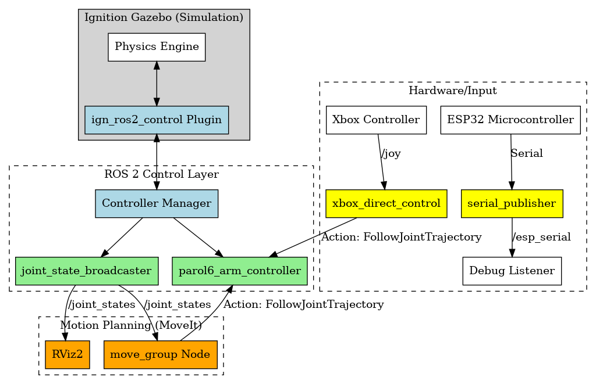
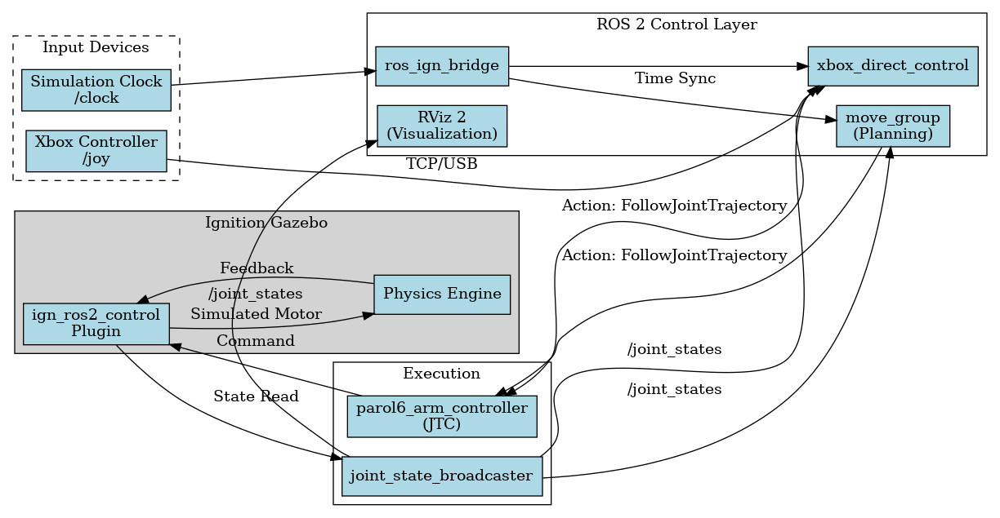

# PAROL6 Project Report

This is a comprehensive technical description of the PAROL6 project, verifying all branches and configurations directly from the source code.

## 1. Project Overview
*   **Robot**: PAROL6 (6-DOF Robotic Arm).
*   **Simulation**: Ignition Gazebo (primary) & Gazebo Classic (legacy).
*   **Control Stack**: ROS 2 Humble + MoveIt 2 + ros2_control.
*   **Middleware**: Micro-ROS for ESP32.

## 2. Docker Architecture
The container content is defined by `Dockerfile` and built via `scripts/setup/rebuild_image.sh`.
*   **Image Name**: `parol6-ultimate:latest`
*   **Base Image**: `osrf/ros:humble-desktop`
*   **Key Components**:
    *   **Gazebo**: Both Classic and Ignition (Fortress) are verified installed.
    *   **MoveIt 2**: `ros-humble-moveit` and `ros-humble-moveit-ros-visualization`.
    *   **Hardware Interface**: `ros-humble-gazebo-ros2-control`.
*   **Build Process**: The `rebuild_image.sh` script halts any running containers, rebuilds from `Dockerfile`, and tags it `parol6-ultimate:latest`. It does **not** rely on pulling from Docker Hub by default; it builds locally.

## 3. ROS 2 Architecture (Verified)
*   **Package**: `parol6` (CMake)
*   **Launch Flow**:
    1.  **Starts**: `ignition.launch.py`.
    2.  **Spawns**: Robot in Ignition Gazebo (`create` nodes).
    3.  **Bridges**: `ros_ign_bridge` connects Ignition topics (`/clock`, `/cmd_vel`) to ROS 2.
    4.  **Controllers**: Spawns `joint_state_broadcaster` and `parol6_arm_controller`.
*   **MoveIt Integration**: `add_moveit.sh` is a separate script run *after* simulation start. It launches `Movit_RViz_launch.py` to bring up the MoveGroup node and RViz 2 independently, preventing race conditions.

## 4. Branch Description (Detailed)
The repository uses a branch-based feature workflow.

| Branch | Verified Content & Purpose |
| :--- | :--- |
| **`ros2_controller`** | **(Active)** Main dev branch. Configured for `ign_ros2_control` with `JointTrajectoryController`. |
| **`main`** | Stable base. Contains core URDF and basic configs. |
| **`xbox-controller`** | Contains `xbox_direct_control.py`.   **Logic**: Subscribes to `/joy`, integrates velocity to position, and sends `FollowJointTrajectory` goals. It is a custom "servo" implementation. |
| **`mobile-ros`** | Contains `ros2_ws/src/mobile_bridge`.   **Logic**: A Python bridge node (`mobile_bridge.py`) that likely uses WebSockets or TCP to communicate with a mobile app (Flutter/React Native). |
| **`ESP32-main`** | Contains `ros2_ws/src/serial_publisher`.   **Logic**: A Python node (`serial_node.py`) designed to talk to the ESP32 via USB Serial, acting as a bridge for hardware that doesn't use micro-ROS directly. |
| **`xbox_camera`** | Integration for Kinect V2. Contains `install_kinect.sh` and `Dockerfile` updates for `libfreenect2`. |
| **`microros_espidf`** | Located in `microros_esp32` folder (in main). Structure confirms it is an **ESP-IDF Component**, meaning the firmware is built using Espressif's IDF tools, not Arduino. |

## 5. File & Script Verification
*   **`start_ignition.sh`**: The master entry point.
    *   Mounts local directory to `/workspace` (hot-reloading code).
    *   Enables GPU acceleration (`--gpus all` or `/dev/dri`).
    *   Runs `colcon build` inside the container on **every run**.
*   **`add_moveit.sh`**:
    *   Checks for running container.
    *   Launches `Movit_RViz_launch.py` inside the container.
*   **`mobile_control/`**: In the current branch, this directory is largely empty/placeholder. The actual code resides in the `mobile-ros` branch.

## 6. Detailed ROS 2 Architecture

### **A. Node Graph & Data Flow**

#### **1. Core Simulation Nodes**
*   **`ros_ign_bridge`** (`parameter_bridge`):
    *   **Function**: Bridges basic simulation data.
    *   **Topics**: `/clock` (Ignition -> ROS), `/model/parol6/pose` (Ignition -> ROS).
*   **`ign_ros2_control`** (Plugin inside Ignition):
    *   **Function**: Acts as the "Hardware Interface". It allows the ROS `controller_manager` to see the Ignition model as if it were a real robot.
    *   **Services**: Exposes the standard `controller_manager` services (list/load/switch controllers).
*   **`spawner`** (controller_manager):
    *   **Function**: Loads the specific controllers defined in `ros2_controllers.yaml`.
    *   **Joint State Broadcaster**: Reads joint positions from Ignition and publishes `/joint_states`.
    *   **Joint Trajectory Controller** (`parol6_arm_controller`): Listens for trajectory goals and commands the Ignition joints.

#### **2. Motion Planning Nodes (MoveIt)**
*   **`move_group`**:
    *   **Function**: The central motion planning brain.
    *   **Inputs**: `/joint_states` (Current position), `/robot_description` (URDF), `/tf` (Transforms).
    *   **Outputs**: `/parol6_arm_controller/follow_joint_trajectory/goal` (Sends planned paths to execution).
    *   **Services**: Provides `/compute_ik`, `/plan_kinematic_path` for external nodes.
*   **`rviz2`**:
    *   **Function**: Visualization.
    *   **Plugin**: `MotionPlanning` plugin connects directly to `move_group` to allow drag-and-drop target setting and visualizes the `/move_group/display_planned_path` topic.

#### **3. Branch-Specific Nodes**
*   **`xbox_direct_control`** (Node: `xbox_direct_control`):
    *   **Source**: `xbox-controller` branch.
    *   **Subscriptions**: `/joy` (Joystick data), `/joint_states`.
    *   **Actions**: Client for `/parol6_arm_controller/follow_joint_trajectory`.
    *   **Logic**: Runs a 10Hz control loop that integrates joystick velocity into a position target and streams trajectory points.
*   **`serial_publisher`** (Node: `serial_publisher`):
    *   **Source**: `ESP32-main` branch.
    *   **Publisher**: `/esp_serial` (`std_msgs/String`).
    *   **Logic**: Reads raw text lines from `/dev/ttyUSB0` (default) and publishes them. This appears to be a uni-directional debug tool, NOT a full robot controller.
*   **`extract_from_bag`**:
    *   **Source**: `xbox_camera` branch (`vision_work/`).
    *   **Logic**: Off-line processing tool to extract images/data from recorded ROS bags, likely for training vision models.

### **B. Connection Diagram**
### **B. Connection Diagram**

### **C. Key Packages & Configs**
1.  **`parol6` (The Description)**:
    *   **`urdf/PAROL6.urdf`**: Defines the physical `link` and `joint` structure.
    *   **Important**: Contains the `<ros2_control>` tag which loads the `ign_ros2_control/IgnitionSystem` plugin. This is the *critical link* between URDF and Ignition.
    *   **`config/ros2_controllers.yaml`**: Defines names and types of controllers (`joint_trajectory_controller/JointTrajectoryController`).
2.  **`parol6_moveit_config` (The Brain)**:
    *   **`config/parol6.srdf`**: Defines the "planning group" (`parol6_arm`) containing joints L1-L6. 
    *   **`config/moveit_controllers.yaml`**: Tells MoveIt *how* to talk to the controllers defined in the `parol6` package. It maps the `parol6_arm` group to the `parol6_arm_controller` action namespace.

## 7. Topic & Network Analysis

### **A. Network Visualization (RQT Graph Style)**
This diagram accurately represents the active ROS 2 node graph during simulation.

### **B. System Topic Table**
A complete list of active topics, their types, and connected nodes.

| Topic Name | Message Type | Publishers | Subscribers | Description |
| :--- | :--- | :--- | :--- | :--- |
| **`/joy`** | `sensor_msgs/Joy` | `joy_node` | `xbox_direct_control` | Raw button/axis data from Gamepad. |
| **`/joint_states`** | `sensor_msgs/JointState` | `joint_state_broadcaster` | `move_group`, `rviz2`, `xbox_direct_control`, `robot_state_publisher` | Real-time angles of joints L1-L6. |
| **`/robot_description`** | `std_msgs/String` | `robot_state_publisher` | `move_group`, `rviz2` | The XML URDF string (Static). |
| **`/tf`** | `tf2_msgs/TFMessage` | `robot_state_publisher` | `move_group`, `rviz2` | Dynamic transforms (Moving links). |
| **`/tf_static`** | `tf2_msgs/TFMessage` | `robot_state_publisher` | `move_group`, `rviz2` | Static transforms (Fixed base). |
| **`/clock`** | `rosgraph_msgs/Clock` | `ros_ign_bridge` | All Nodes (`use_sim_time=True`) | Simulation time sync. |
| **`/parol6_arm_controller/follow_joint_trajectory/goal`** | `FollowJointTrajectoryAction` | `move_group`, `xbox_direct_control` | `parol6_arm_controller` | The command target for the robot. |
| **`/monitored_planning_scene`** | `moveit_msgs/PlanningScene` | `move_group` | `rviz2` | The 3D world representation (obstacles + robot). |
| **`/move_group/display_planned_path`** | `moveit_msgs/DisplayTrajectory` | `move_group` | `rviz2` | The "Ghost" robot trail you see in RViz. |
| **`/esp_serial`** | `std_msgs/String` | `serial_publisher` | (Debug Tools) | **(ESP32-main branch only)** Raw serial debug data. |

### **C. Key Services & Actions**
| Service/Action | Type | Server | Client | Purpose |
| :--- | :--- | :--- | :--- | :--- |
| **`/compute_ik`** | `GetPositionIK` | `move_group` | External / RViz | Calculate joint angles from XYZ pose. |
| **`/plan_kinematic_path`** | `GetMotionPlan` | `move_group` | External | Calculate collision-free path. |
| **`/parol6_arm_controller/follow_joint_trajectory`** | `FollowJointTrajectory` | `parol6_arm_controller` | `move_group` / `xbox_direct_control` | The "Move" command. |

