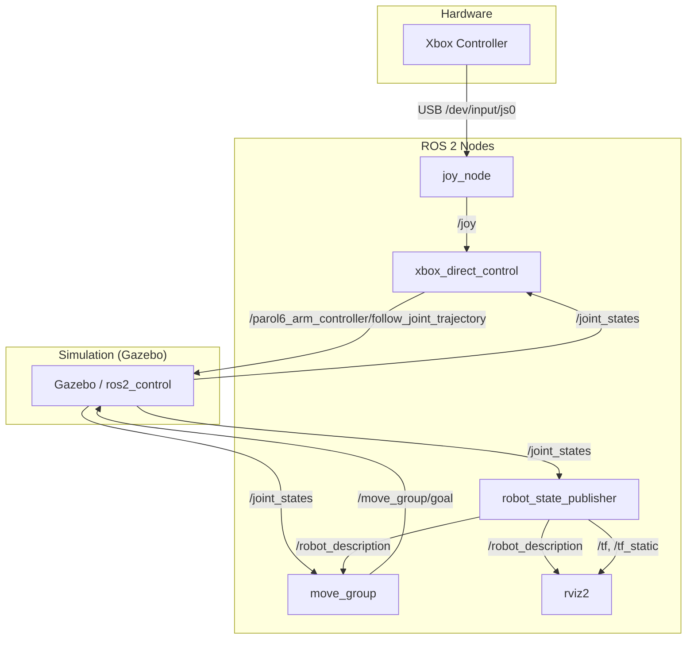

# PAROL6 ROS 2 Project Explanation

Welcome! This document is designed to explain the PAROL6 ROS 2 project from the bottom up. It is written for beginners who want to understand how all the pieces fit together to control a robot arm using ROS 2.

## 🏗️ 1. The Foundation: Docker Environment

Before we touch any robot code, we need a computer environment to run it. We use **Docker** for this. Think of Docker as a "virtual computer" that lives inside your laptop. It ensures that everyone (you and your colleagues) has the exact same software versions, so "it works on my machine" is always true.

### 📄 File: `Dockerfile`
This file is the "recipe" for building that virtual computer.

```dockerfile
# 1. Base Image: Start with a version of Linux (Ubuntu) that has ROS 2 Humble pre-installed.
FROM osrf/ros:humble-desktop

# 2. Install Dependencies: Add extra tools we need, like Gazebo (simulator) and MoveIt (motion planning).
RUN apt-get update && apt-get install -y \
    ros-humble-gazebo-ros-pkgs \       # Connects ROS 2 to Gazebo
    ros-humble-gazebo-ros2-control \   # Allows ROS 2 to control Gazebo motors
    ros-humble-moveit \                # Motion planning library
    ros-humble-rviz2 \                 # 3D Visualization tool
    gazebo \                           # The simulator itself
    && rm -rf /var/lib/apt/lists/*     # Clean up to keep image small

# 3. Workspace: Create a folder where our code will live inside the container.
WORKDIR /workspace

# 4. Auto-Source: Make sure ROS 2 commands are available every time we open a terminal.
RUN echo "source /opt/ros/humble/setup.bash" >> ~/.bashrc

# 5. Default Command: When the container starts, give us a bash terminal.
CMD ["/bin/bash"]
```

---

## 🤖 2. The Body: Robot Description (URDF)

Now that we have an OS, we need to tell ROS what our robot looks like. We use **URDF** (Unified Robot Description Format), which is an XML file.

### 📄 File: `PAROL6/urdf/PAROL6.urdf`
This file defines the **Links** (solid parts) and **Joints** (moving hinges) of the robot.

#### A. Defining a Link (A solid part)
```xml
<link name="base_link">
  <!-- 1. Inertial: Mass and center of gravity (needed for physics simulation) -->
  <inertial>
    <mass value="0.812" />
    <inertia ixx="0.001" ... /> 
  </inertial>

  <!-- 2. Visual: What it looks like (3D mesh) -->
  <visual>
    <geometry>
      <mesh filename="package://parol6/meshes/base_link.STL" />
    </geometry>
  </visual>

  <!-- 3. Collision: The physical shape for bumping into things (often same as visual) -->
  <collision>
    <geometry>
      <mesh filename="package://parol6/meshes/base_link.STL" />
    </geometry>
  </collision>
</link>
```

#### B. Defining a Joint (A hinge)
```xml
<joint name="joint_L1" type="revolute">
  <!-- 1. Parent and Child: Connects base_link to Link 1 -->
  <parent link="base_link" />
  <child link="L1" />

  <!-- 2. Axis: Rotates around the Z axis (0 0 1) -->
  <axis xyz="0 0 1" />

  <!-- 3. Limits: Can rotate from -1.7 to +1.7 radians -->
  <limit lower="-1.7" upper="1.7" effort="300" velocity="3" />
</joint>
```

#### C. The Brain Interface: `ros2_control`
This special section tells ROS how to talk to the motors (or simulated motors).

```xml
<ros2_control name="IgnitionSystem" type="system">
  <hardware>
    <!-- Use the Ignition Gazebo plugin to simulate hardware -->
    <plugin>ign_ros2_control/IgnitionSystem</plugin>
  </hardware>
  
  <joint name="joint_L1">
    <!-- We can send POSITION commands to this joint -->
    <command_interface name="position">
      <param name="min">-1.7</param>
      <param name="max">1.7</param>
    </command_interface>
    <!-- We can read the current POSITION from this joint -->
    <state_interface name="position"/>
  </joint>
  ...
</ros2_control>
```

---

## 🚀 3. The Launcher: Starting the World

We have a computer (Docker) and a robot (URDF). Now we need to start the simulation.

### 📄 File: `start_ignition.sh`
This is a Bash script (like a batch file) that automates the complex startup process.

```bash
#!/bin/bash

# 1. Enable Graphics: Allow the Docker container to show windows on your screen.
xhost +local:docker > /dev/null 2>&1

# 2. Start Docker: Run the image we built, mounting our code folder (/workspace).
docker run -d --rm \
  --name parol6_dev \
  --network host \
  --privileged \
  -v /home/kareem/Desktop/PAROL6_URDF:/workspace \
  parol6-ultimate:latest \
  tail -f /dev/null

# 3. Build Code: Compile the ROS packages inside the container.
docker exec parol6_dev bash -c "source /opt/ros/humble/setup.bash && cd /workspace && colcon build"

# 4. Launch ROS: Run the main launch file.
docker exec -it parol6_dev bash -c "
  source /opt/ros/humble/setup.bash && \
  source /workspace/install/setup.bash && \
  ros2 launch parol6 ignition.launch.py
"
```

---

## 🧠 4. The Planner: MoveIt & RViz

While `ros2_control` moves the motors, **MoveIt** decides *how* to move them to avoid collisions and reach a goal.

### 📄 File: `parol6_moveit_config/config/parol6.srdf`
The SRDF (Semantic Robot Description Format) adds "meaning" to the URDF.

```xml
<robot name="parol6">
    <!-- 1. Groups: Defines "parol6_arm" as the chain from base_link to L6 -->
    <group name="parol6_arm">
        <chain base_link="base_link" tip_link="L6"/>
    </group>

    <!-- 2. Poses: Pre-defined positions like "home" -->
    <group_state name="home" group="parol6_arm">
        <joint name="joint_L1" value="0"/>
        ...
    </group_state>

    <!-- 3. Collisions: Tells MoveIt which parts can safely touch (e.g., adjacent links) -->
    <disable_collisions link1="L1" link2="L2" reason="Adjacent"/>
</robot>
```

### 📄 File: `parol6_moveit_config/config/kinematics.yaml`
This tells MoveIt which math solver to use to calculate joint angles from a 3D position (Inverse Kinematics).

```yaml
parol6_arm:
  kinematics_solver: kdl_kinematics_plugin/KDLKinematicsPlugin
  kinematics_solver_search_resolution: 0.005
```

### 👁️ RViz (Visualization)
RViz is the 3D tool you see. It subscribes to topics like `/joint_states` and `/robot_description` to draw the robot in 3D space. It allows you to drag the robot arm to set goals for MoveIt.

---

## 🎮 5. The Controller: Xbox Direct Control

Finally, we want to move the robot with an Xbox controller. This is where our Python script comes in.

### 📄 File: `xbox_direct_control.py`
This script acts as a "bridge". It listens to the Xbox controller and sends commands to the robot.

#### A. Setup and Connections
```python
class XboxDirectControl(Node):
    def __init__(self):
        super().__init__('xbox_direct_control')
        
        # 1. Action Client: The way we send commands to the robot controller.
        # We send a "trajectory" (a path of movement).
        self._action_client = ActionClient(self, FollowJointTrajectory, '/parol6_arm_controller/follow_joint_trajectory')
        
        # 2. Subscriber: Listen to the Xbox controller inputs.
        self.joy_sub = self.create_subscription(Joy, 'joy', self.joy_callback, 10)
        
        # 3. Subscriber: Listen to where the robot currently IS (Joint States).
        self.joint_sub = self.create_subscription(JointState, 'joint_states', self.joint_state_callback, 10)
```

#### B. The Logic Loop (`joy_callback`)
This function runs every time you move a joystick.

```python
    def joy_callback(self, msg):
        # 1. Map Joystick Axes to Robot Joints
        # msg.axes[0] is the Left Stick Horizontal
        # self.target_positions[0] is Joint 1
        self.target_positions[0] -= msg.axes[0] * self.speed_scale

        # 2. Safety Limits: Don't let the robot hit itself (Software Limit)
        self.target_positions[0] = max(-3.14, min(3.14, self.target_positions[0]))
        
        # 3. Send the Command
        self.send_goal()
```

#### C. Sending the Command (`send_goal`)
```python
    def send_goal(self):
        goal_msg = FollowJointTrajectory.Goal()
        
        # Create a trajectory point (where we want to be 0.2 seconds from now)
        point = JointTrajectoryPoint()
        point.positions = self.target_positions
        point.time_from_start = Duration(sec=0, nanosec=200000000) # 200ms
        
        # Send it!
        goal_msg.trajectory.points.append(point)
        self._action_client.send_goal_async(goal_msg)
```

---

## 🔗 6. System Architecture (Node Graph)

Here is a visual representation of how the nodes communicate. This is what you would see if you ran `rqt_graph`.



---

## 📋 7. System Reference

This section lists all the "moving parts" of your system. This is crucial for debugging.

### 🟢 Active Nodes
| Node Name | Description | Package |
|-----------|-------------|---------|
| `joy_node` | Reads joystick input from Linux. | `joy` |
| `xbox_direct_control` | **Your Script**. Converts joystick -> robot commands. | (Custom) |
| `move_group` | The MoveIt "Brain". Handles planning & collision checking. | `moveit_ros_move_group` |
| `ros2_control_node` | Runs inside Gazebo. Simulates the motor drivers. | `controller_manager` |
| `robot_state_publisher` | Broadcasts the position of every robot link (TF). | `robot_state_publisher` |
| `rviz2` | Visualization GUI. | `rviz2` |

### 📨 Key Topics (Data Streams)
| Topic Name | Message Type | Purpose |
|------------|--------------|---------|
| `/joy` | `sensor_msgs/Joy` | Raw buttons and axis data from Xbox. |
| `/joint_states` | `sensor_msgs/JointState` | Current angle of every joint. |
| `/robot_description` | `std_msgs/String` | The URDF XML content. |
| `/tf` | `tf2_msgs/TFMessage` | Dynamic transforms (moving parts). |
| `/tf_static` | `tf2_msgs/TFMessage` | Static transforms (fixed parts). |

### 🛠️ Key Services (Functions)
| Service Name | Type | Purpose |
|--------------|------|---------|
| `/compute_ik` | `GetPositionIK` | Calculate joint angles for a given XYZ position. |
| `/plan_kinematic_path` | `GetMotionPlan` | Generate a collision-free path from A to B. |

### 🎬 Key Actions (Long-Running Tasks)
| Action Name | Type | Purpose |
|-------------|------|---------|
| `/parol6_arm_controller/follow_joint_trajectory` | `FollowJointTrajectory` | Move the robot along a path (used by your script). |
| `/move_group` | `MoveGroup` | High-level MoveIt command (e.g., "Go to Home"). |

---

## 🎓 8. How to Expand: Building Robust Robotics

You mentioned you want to build a **robust** system for your thesis. Here is the roadmap to go from "Direct Control" to "Intelligent Robotics".

### A. Switch to MoveIt (The "Right" Way)
Currently, `xbox_direct_control.py` moves the robot blindly. If there is a wall, it will hit it. To fix this, you should use the **MoveIt MoveGroup Interface**.

**What to do:**
1.  Create a new Python script (e.g., `smart_planner.py`).
2.  Use the `moveit_commander` library (Python) or `moveit_cpp` (C++).
3.  Instead of calculating joint angles yourself, you say: "Go to [X, Y, Z]".
4.  MoveIt will:
    *   Check for collisions.
    *   Plan a smooth path around obstacles.
    *   Execute the path.

**Code Snippet (Python Example):**
```python
import moveit_commander

# Initialize
group = moveit_commander.MoveGroupCommander("parol6_arm")

# Set a target (e.g., 20cm forward)
group.set_position_target([0.2, 0.0, 0.4])

# Plan and Execute
plan = group.go(wait=True)
group.stop()
```

### B. Add Perception (Eyes)
A robot is blind without sensors.
1.  **Add a Camera**: Add a RealSense or Kinect camera to your URDF.
2.  **Octomap**: Configure MoveIt to read the camera's PointCloud. MoveIt will automatically build a 3D map of the world (Octomap) and avoid obstacles dynamically.

### C. Add a Gripper
1.  Update URDF to include a gripper link.
2.  Add a new `ros2_control` interface for the gripper.
3.  Use MoveIt to plan "Pick and Place" tasks.

### D. State Machines (Behavior)
For complex tasks (e.g., "Pick up cup, if heavy, put it down"), don't use `if/else` in Python. Use a **Behavior Tree**.
*   **Tools**: `BehaviorTree.CPP` or `py_trees_ros`.
*   This allows you to create modular, reusable behaviors.

---

## 📚 Next Steps for Learning

1.  **Modify the Speed**: Change `self.speed_scale` in `xbox_direct_control.py` to make it faster or slower.
2.  **Change Mappings**: Swap which joystick axis controls which joint.
3.  **Add a Button**: Make the "A" button (index 0 in `msg.buttons`) reset the robot to the home position (all zeros).

Happy Coding! 🚀
