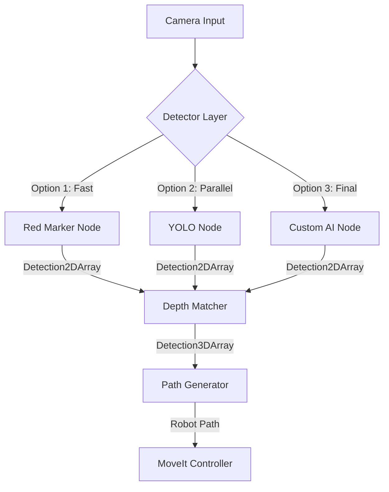

# PAROL6 URDF - 6-DOF Robot Arm with ROS 2 Control

**ROS 2 Humble | ros2_control | MoveIt 2 | Docker | ESP32**

[]()
[]()
[]()

---

## 🎯 Project Overview

PAROL6 is a 6-DOF robotic arm integrated with ROS 2 Humble, featuring:
- **ros2_control** hardware interface
- **ESP32** motor control via serial
- **MoveIt 2** motion planning
- **Docker** development environment
- **Kinect v2** vision integration

**Current Status:** 🚀 Day 1 SIL Validation Complete (25Hz, 0.28ms jitter)

---

## 🚀 Quick Start

### For Teammates (5 Minutes)

```bash
# 1. Clone repository
git clone <your-repo-url>
cd PAROL6_URDF

# 2. Start Docker container
./start_container.sh

# 3. Enter container
docker exec -it parol6_dev bash

# 4. Build workspace
cd /workspace
colcon build --symlink-install
source install/setup.bash

# 5. Launch SIL validation
ros2 launch parol6_hardware real_robot.launch.py
```

**See:** [parol6_hardware/README.md](parol6_hardware/README.md) for detailed setup

---

## 📁 Repository Structure

```
PAROL6_URDF/
├── README.md                    # This file
├── start_container.sh           # Docker startup script
├── .github/                     # GitHub Projects integration
│   ├── ISSUE_TEMPLATE/          # Day 1-5 issue templates
│   ├── workflows/               # Automation
│   └── GITHUB_PROJECTS_SETUP.md # Team collaboration guide
├── parol6_hardware/             # ⭐ ros2_control package
│   ├── README.md                # Setup & troubleshooting
│   ├── DAY1_BUILD_TEST_GUIDE.md # SIL validation guide
│   ├── DAY2_SERIAL_TX_PLAN.md   # Next phase plan
│   ├── HARDWARE_INTERFACE_GUIDE.md # Developer reference
│   ├── src/                     # C++ hardware interface
│   ├── launch/                  # Launch files
│   ├── config/                  # Controller configuration
│   └── urdf/                    # Robot description
├── esp32_benchmark_idf/         # ESP32 firmware
├── parol6_demos/                # MoveIt demo scripts
├── docs/                        # 📚 Documentation
│   ├── KINECT_INTEGRATION.md    # Vision setup
│   ├── GET_STARTED.md           # Onboarding guide
│   ├── TROUBLESHOOTING.md       # Common issues
│   └── archived/                # Old documentation
└── README.md                    # This file
```

---

## 🔬 Development Phases

| Phase | Status | Description |
|-------|--------|-------------|
| **Day 1: SIL** | ✅ **COMPLETE** | Software-in-the-Loop validation (25Hz, 0.28ms jitter) |
| **Day 2: Serial TX** | 📋 Planned | Implement serial transmission to ESP32 |
| **Day 3: Feedback** | 📋 Planned | Close control loop with ESP32 feedback |
| **Day 4: First Motion** | 📋 Planned | Safe hardware activation |
| **Day 5: Validation** | 📋 Planned | Thesis-ready formal validation |

**See:** [.gemini/.../task.md](.gemini/antigravity/brain/dc8d8804-d852-433b-a7ff-1bee8308aba2/task.md) for detailed roadmap

---

## 📚 Key Documentation

### Getting Started
- **[parol6_hardware/README.md](parol6_hardware/README.md)** - Main hardware interface guide
- **[docs/GET_STARTED.md](docs/GET_STARTED.md)** - Team onboarding
- **[.github/GITHUB_PROJECTS_SETUP.md](.github/GITHUB_PROJECTS_SETUP.md)** - Project management

### Technical Guides
- **[parol6_hardware/HARDWARE_INTERFACE_GUIDE.md](parol6_hardware/HARDWARE_INTERFACE_GUIDE.md)** - Architecture & timing
- **[parol6_hardware/DAY1_BUILD_TEST_GUIDE.md](parol6_hardware/DAY1_BUILD_TEST_GUIDE.md)** - Validation procedure
- **[docs/KINECT_INTEGRATION.md](docs/KINECT_INTEGRATION.md)** - Vision integration

### Development Plans
- **[parol6_hardware/DAY2_SERIAL_TX_PLAN.md](parol6_hardware/DAY2_SERIAL_TX_PLAN.md)** - Next phase implementation

---

## 🛠️ Technology Stack

- **ROS 2:** Humble
- **Control:** ros2_control, MoveIt 2
- **Hardware:** ESP32 (serial @ 115200 baud)
- **Simulation:** Gazebo Ignition
- **Vision:** Kinect v2 (libfreenect2)
- **Container:** Docker (parol6-ultimate:latest)

---

## 👁️ Modular Vision Architecture

We use a **swappable detector** strategy to parallelize work:



**See:** [docs/TEAM_WORKFLOW_GUIDE.md](docs/TEAM_WORKFLOW_GUIDE.md#15-modular-vision-architecture)

---

## 🎓 Thesis Integration

This project includes:
- ✅ Formal validation reports
- ✅ Engineering gate criteria
- ✅ Failure containment analysis
- ✅ Performance metrics (timing, jitter)
- ✅ GitHub Projects for progress tracking

**See:** [parol6_hardware/README.md](parol6_hardware/README.md) - Formal Validation Statement

---

## 👥 Team Collaboration

**Using GitHub Projects:**
1. Create issues from templates (`.github/ISSUE_TEMPLATE/`)
2. Assign phases (Day 1-5)
3. Track progress on project board
4. Link code to tasks automatically

**Guide:** [.github/GITHUB_PROJECTS_SETUP.md](.github/GITHUB_PROJECTS_SETUP.md)

---

## 🐛 Troubleshooting

**Common issues:**
- **Build errors:** See [docs/TROUBLESHOOTING.md](docs/TROUBLESHOOTING.md)
- **Controller failures:** See [parol6_hardware/README.md](parol6_hardware/README.md#troubleshooting)
- **Container issues:** Restart with `./start_container.sh`

---

## 📊 Current Status

**Day 1 SIL Validation Results:**
- ✅ Controllers: Both ACTIVE
- ✅ Update rate: 25.000 Hz
- ✅ Jitter: 0.28 ms (EXCELLENT)
- ✅ Stability: 2,276+ samples
- ✅ Status: **APPROVED for Day 2**

---

## 🚀 Next Steps

1. **Review Day 1:** [walkthrough.md](.gemini/antigravity/brain/dc8d8804-d852-433b-a7ff-1bee8308aba2/walkthrough.md)
2. **Plan Day 2:** [DAY2_SERIAL_TX_PLAN.md](parol6_hardware/DAY2_SERIAL_TX_PLAN.md)
3. **Create GitHub Project:** [GITHUB_PROJECTS_SETUP.md](.github/GITHUB_PROJECTS_SETUP.md)

---

**Version:** v1.0.0 (Day 1 SIL Complete)  
**Last Updated:** 2026-01-14  
**Contact:** PAROL6 Team
