# ASPIRE Presentation Guide
### Autonomous System for Path Identification and Robotic Execution

> A complete speaker's guide with visual slide references and talking points.
> Organized in 4 sections: **Literature Review → Core Concepts → Technical Deep-Dive → Engineering Triumphs**

---

## SECTION 1: Literature Review — The Problem & Evolution

### Slide 1 — The Problem Statement

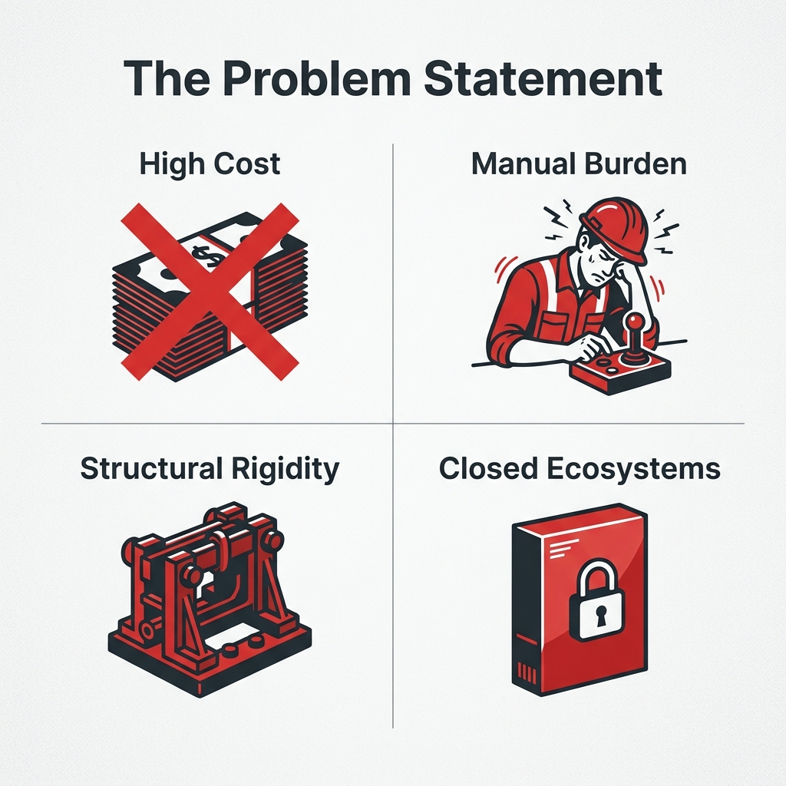

**Talking Points:**
- **High Cost**: Modern intelligent welding systems cost $100k–$200k. Small and medium-sized businesses are completely priced out.
- **Manual Burden**: "Teaching" a robot every single weld path is a tedious expert-only process that makes automation useless for small-batch or varied production.
- **Structural Rigidity**: Traditional robots are *blind*. Factories must build heavy, expensive iron "Jigs" to clamp parts into the exact same position every time. If the part shifts by 1mm — the weld fails.
- **Closed Ecosystems**: Commercial industrial robots are black boxes. You cannot add modern AI, change the sensor, or integrate open tools without expensive vendor contracts.

---

### Slide 2 — Detailed Evolution of Robotic Welding (Timeline Overview)

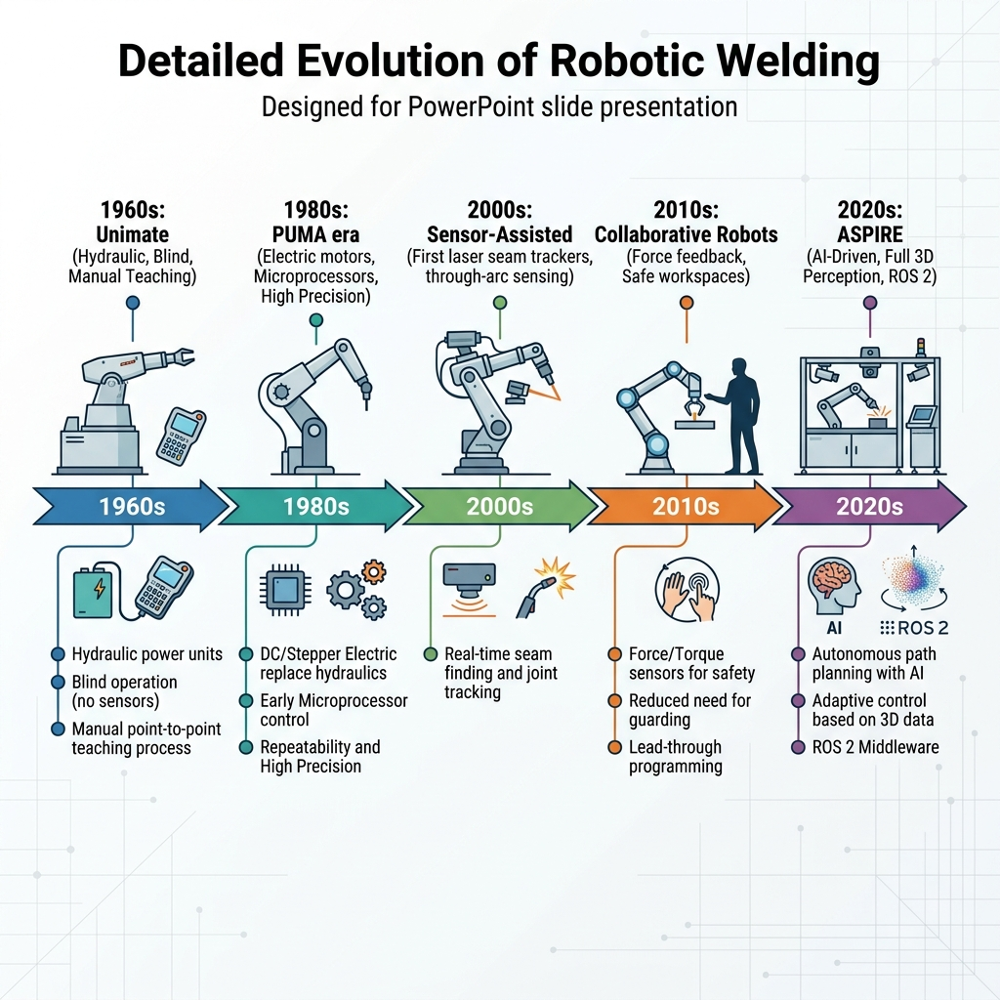

**Talking Points:**
- This timeline shows the 60-year journey from simple mechanical motion to autonomous AI intelligence.
- We will go through each phase and show exactly what limitation ASPIRE finally overcomes.

---

### Slide 3 — Phase 1: 1960s — The Blind Giants (Unimate)

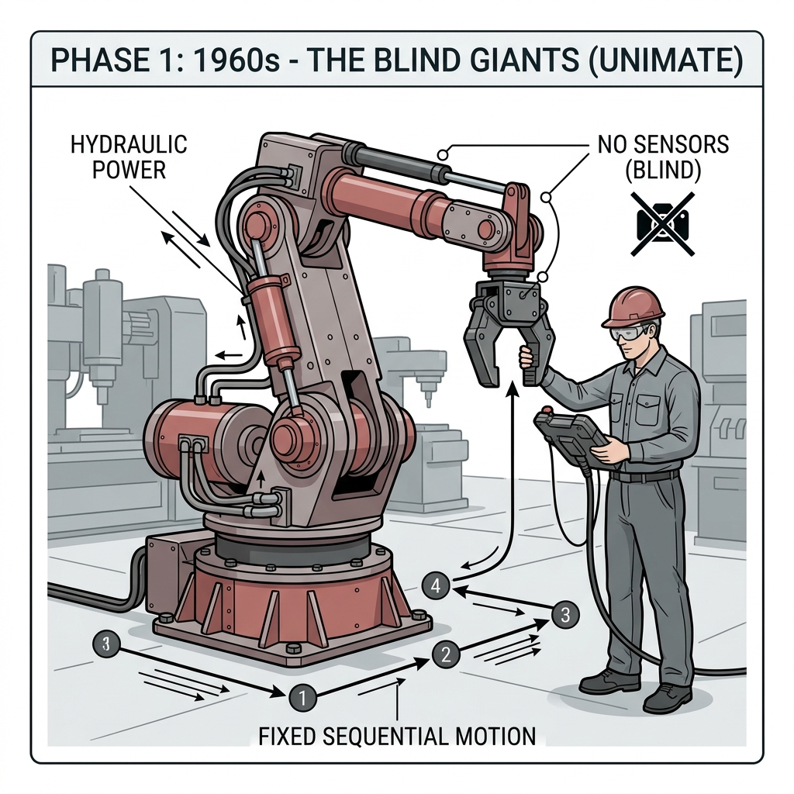

**Talking Points:**
- **Technology**: High-pressure hydraulics and hard-wired relay logic.
- **Operation**: Had no software. A magnetic drum recorded a sequence of relay states which it repeated indefinitely.
- **Limitation**: No sensing whatsoever. No feedback. If a part was slightly out of place, the robot would crash into it and destroy both the part and the tool.

---

### Slide 4 — Phase 2: 1980s — The Precision Era (PUMA)

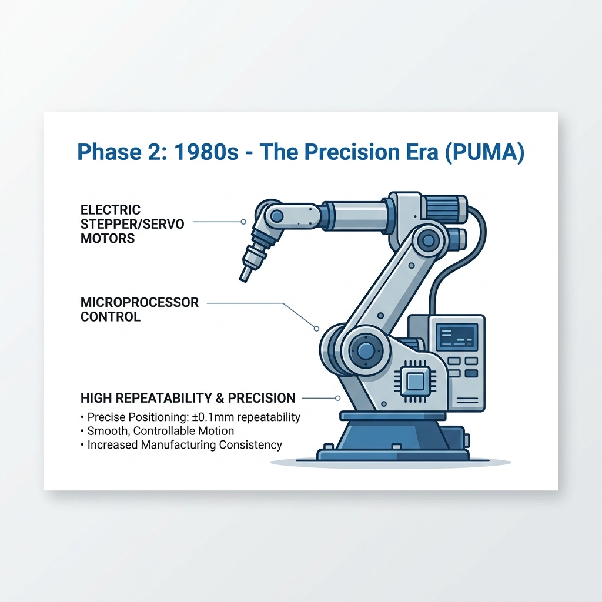

**Talking Points:**
- **Technology**: Electric DC/Servo motors replaced hydraulics, 8-bit microprocessors enabled digital control loops.
- **Operation**: For the first time, robots could achieve sub-millimeter (±0.1mm) positional repeatability.
- **Impact**: Enabled the mass-production automotive industry as we know it today. But robots were still limited to unchanging, perfectly rigid factory lines.

---

### Slide 5 — Phase 3: 2000s — The First Senses (Sensor-Assisted)

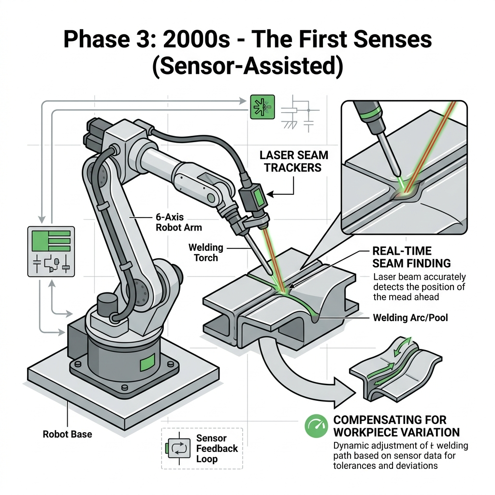

**Talking Points:**
- **Technology**: Laser line triangulation sensors mounted near the welding torch. "Through-arc sensing" measured the arc current to infer seam position.
- **Operation**: The first time robots could *feel* the weld seam and make small corrective adjustments during the weld itself.
- **Limitation**: Still required expensive, slow, dedicated sensors. Could only track, not plan. Could not handle part-to-part variation in 3D space.

---

### Slide 6 — Phase 4: 2010s — The Collaborative Era (Cobots)

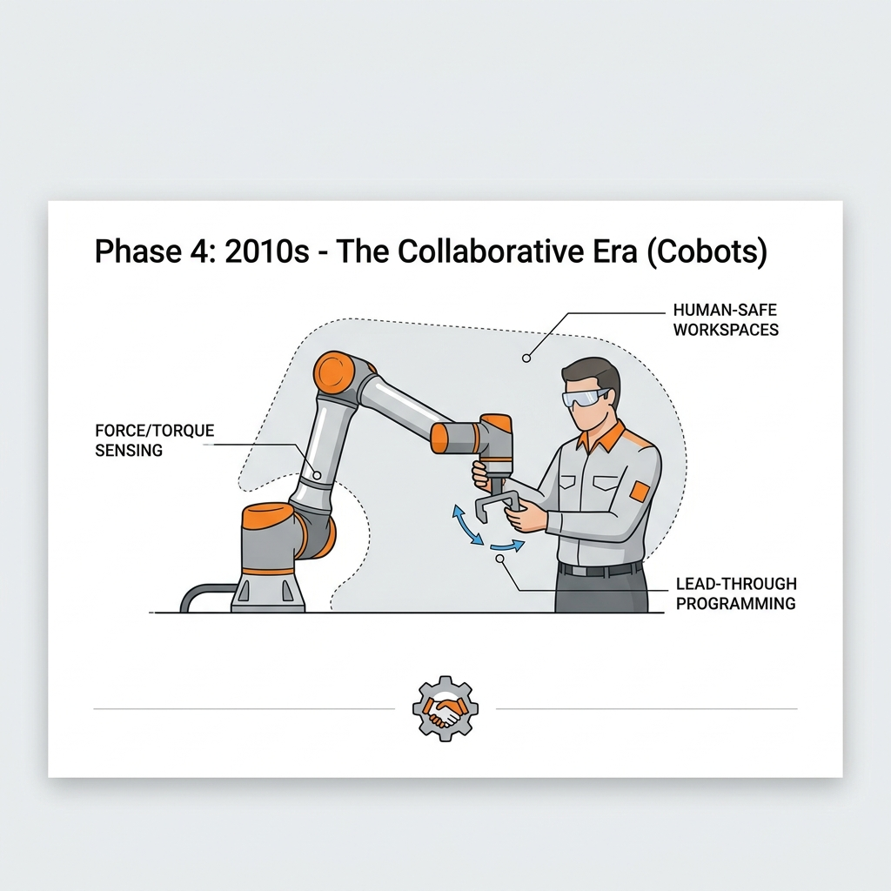

**Talking Points:**
- **Technology**: Force/Torque sensors at every joint. Impedance control algorithms.
- **Innovation**: "Lead-Through Programming" — an operator simply grabs the robot arm and physically moves it to define a path. The robot records the motion.
- **Impact**: Robots left their safety cages and started sharing workspaces with humans. But they still lacked true 3D vision and autonomous decision-making.

---

### Slide 7 — Phase 5: 2020s — ASPIRE (The Autonomous Era)

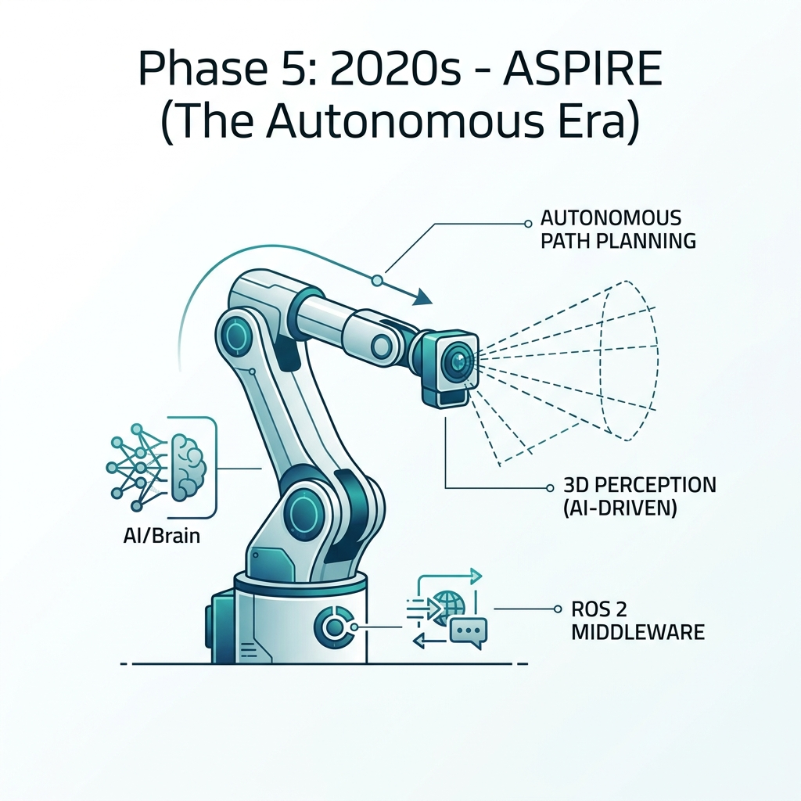

**Talking Points:**
- **Technology**: 3D RGB-D Perception (Kinect v2 ToF), YOLOv8 AI instance segmentation, ROS 2 Middleware.
- **Operation**: The robot *perceives physical 3D space*. It identifies the weld geometry, generates its own smooth B-Spline path, checks it for collisions, and executes it — all autonomously.
- **This is where ASPIRE sits.** We have crossed the line from *motion replay* to *intelligent perception and action*.

---

### Slide 8 — Evolution of 3D Vision Technologies

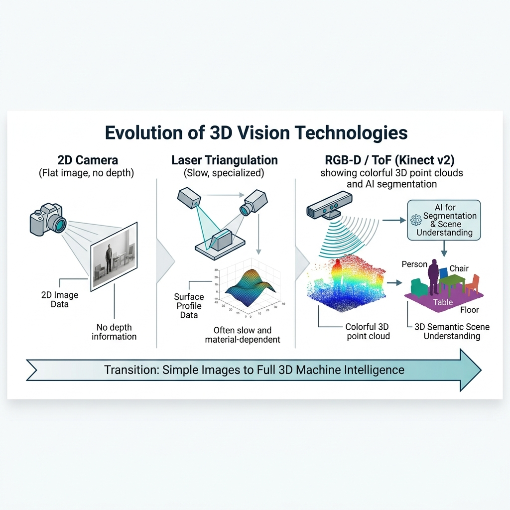

**Talking Points:**
- **The 2D Era**: Cameras only captured pixels — flat color images with no depth information.
- **Laser Triangulation**: Projected a line and measured the geometric deformation to infer depth. Slow and only worked on small regions.
- **The RGB-D Revolution (Time-of-Flight)**: The Microsoft Kinect v2 uses Time-of-Flight to measure depth for every pixel simultaneously at 30 FPS. This democratized 3D sensing.
- ASPIRE's entire vision pipeline is built on this technology: the Kinect v2 provides both the color image (for YOLO) and the depth map (for 3D path extraction).

---

### Slide 9 — Industry Gap Analysis

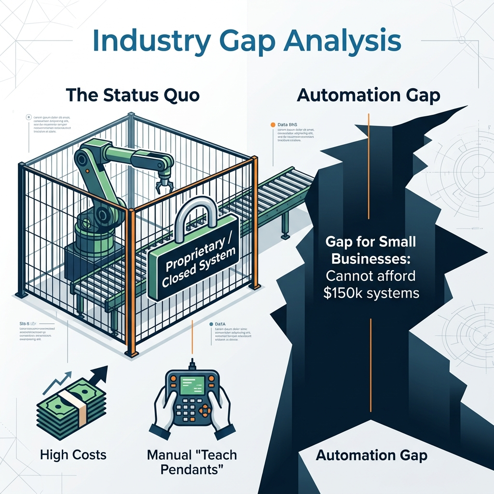

**Talking Points:**
- **Gap 1 — Flexibility vs. Cost**: There is no affordable system that can dynamically generate and execute a weld path without requiring $100k+ hardware.
- **Gap 2 — Lab vs. Real-World Integration**: Many academic papers demonstrate "vision-guided welding," but none use a cohesive, deployable middleware like ROS 2 that integrates vision, planning, and hardware in one stack.
- **Gap 3 — Intelligence to Action**: Most systems can *detect* or *classify* a seam. The missing link is translating that into a *collision-free, physically executable* robot trajectory. ASPIRE provides this entire pipeline end-to-end.

---

### Slide 10 — Existing Systems: Teach & Playback

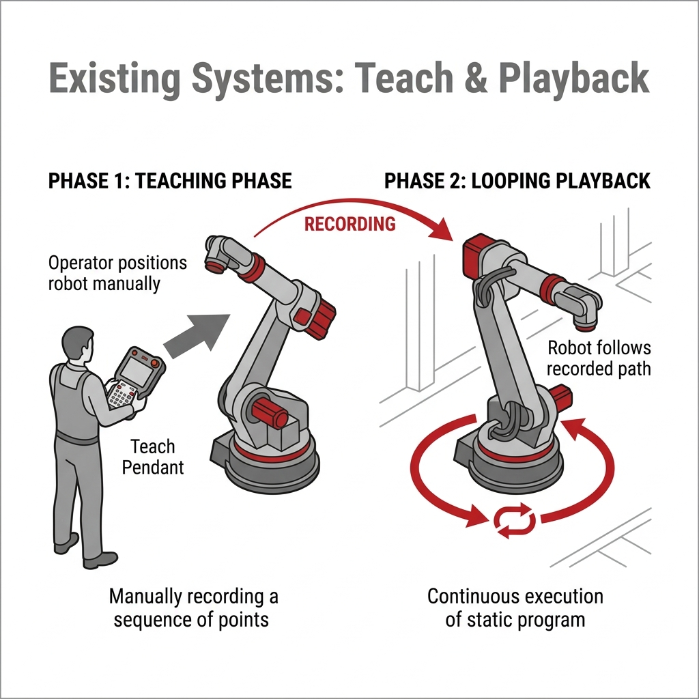

**Talking Points:**
- Every traditional industrial welding setup starts with a **"Teach Phase"**: a skilled engineer physically moves the arm to each weld point and saves a coordinate.
- During **"Playback"**, the robot loops those exact coordinates indefinitely. It has no understanding of *why* it is moving — only *where*.
- Reprogramming for a new part requires starting from scratch. This is why automation is economically unviable for anything but high-volume identical production.

---

### Slide 11 — Existing Systems: The Fixed Workspace Problem

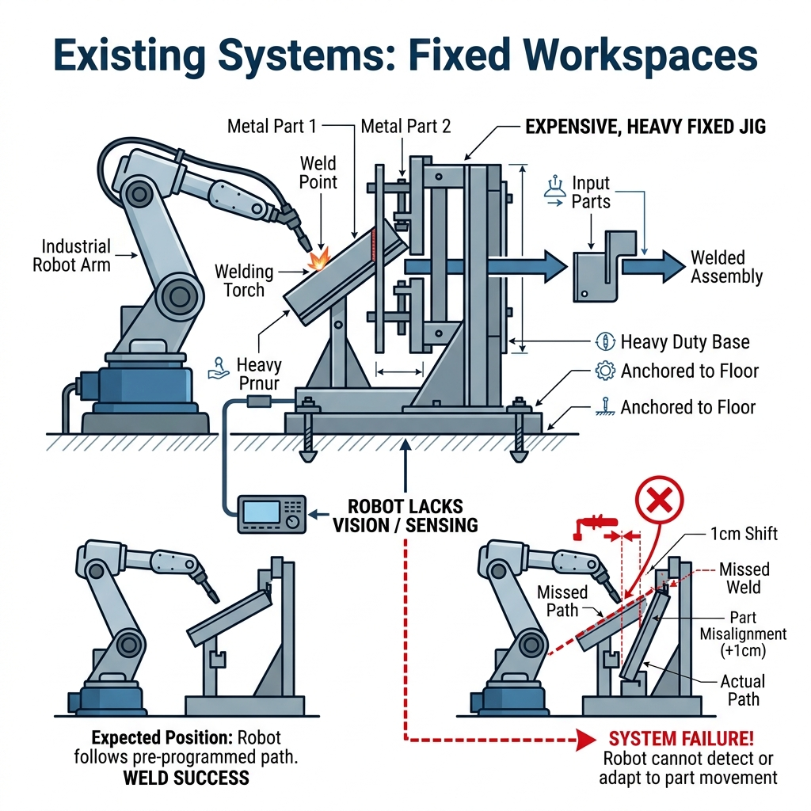

**Talking Points:**
- Because blind robots cannot detect part position, factories invest in **Fixed Jigs** — precision-machined metal frames that hold every part in the exact same location.
- These jigs cost thousands of dollars and must be completely redesigned for every new part variant.
- If the part shifts even 1cm due to thermal expansion or a placement error — the robot misses the seam entirely.
- **ASPIRE eliminates the need for jigs entirely.** Just place the workpiece within the camera's field of view, and the system finds the seam autonomously.

---

### Slide 12 — ASPIRE: Bridging the Gap

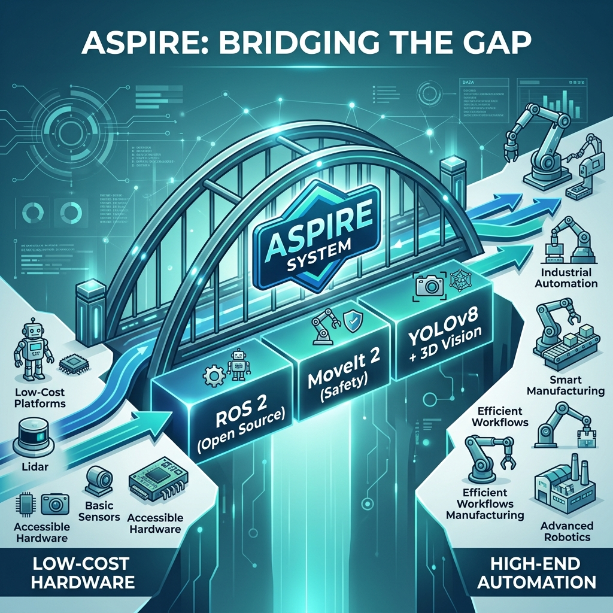

**Talking Points:**
- ASPIRE bridges the gap between *low-cost accessible hardware* and *high-end intelligent automation*.
- **Three pillars of the bridge**:
  - **ROS 2** — Open-source, distributed middleware that connects every component.
  - **MoveIt 2** — Provides mathematically guaranteed, collision-free trajectory planning.
  - **YOLOv8 + Kinect v2** — AI-driven 3D perception that replaces the rigid jig and the teach pendant.
- Together these three turn a $3,000 hardware platform into something approaching a $150,000 industrial cell in capability.

---

## SECTION 2: Why ROS 2? — Core Concepts

### Slide 13 — Managing Control Complexity

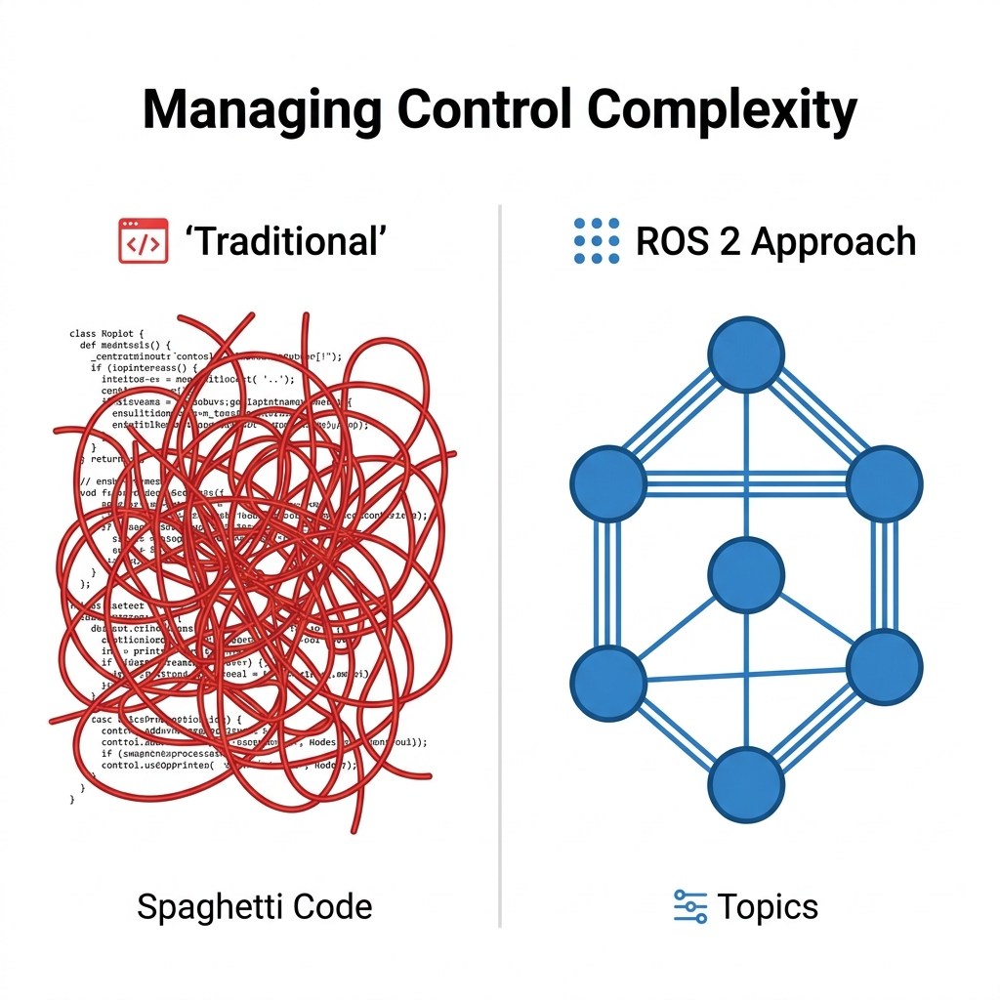

**Talking Points:**
- Controlling 6 motors, a 3D camera, and an AI pipeline in one monolithic program creates "Spaghetti Code" — deeply fragile and impossible to debug.
- **ROS 2's answer is decomposition**: Every responsibility becomes an isolated "Node" that publishes and subscribes to named "Topics." Each node can be developed, tested, and replaced independently.
- Analogy: Instead of one massive water main, ROS networks them like a plumbing grid — any pipe can be replaced or upgraded without touching the others.

---

### Slide 14 — ROS 2: The Digital Nerves of ASPIRE

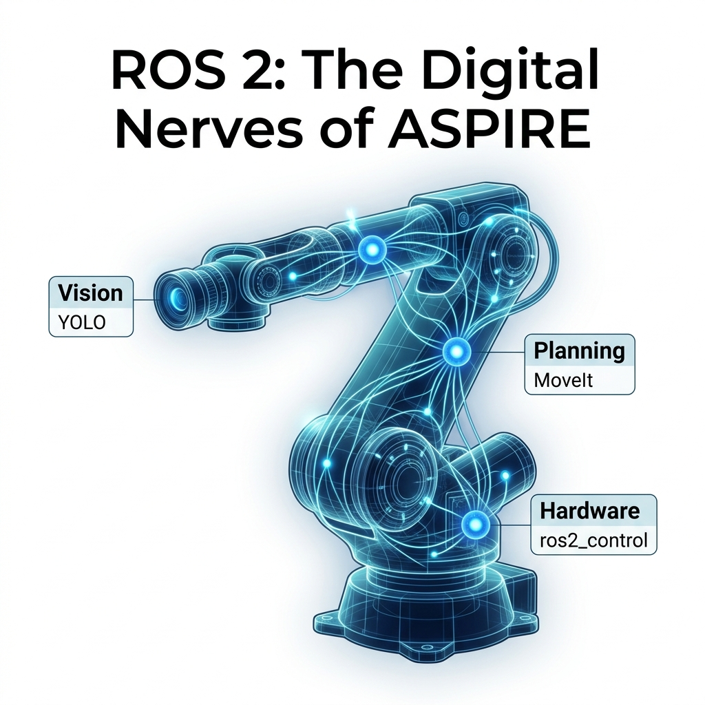

**Talking Points:**
- ROS 2 is **Middleware** — not an OS, not an application, but the communication fabric that connects everything.
- It connects ASPIRE's four pillars: **3D Vision → AI Processing → Motion Planning → Physical Arm**.
- **Language-agnostic**: The YOLO vision pipeline runs in Python. The hardware interface runs in C++. ROS 2 handles the translation seamlessly via its message-passing standard.

---

### Slide 15 — The Modular ROS 2 Ecosystem

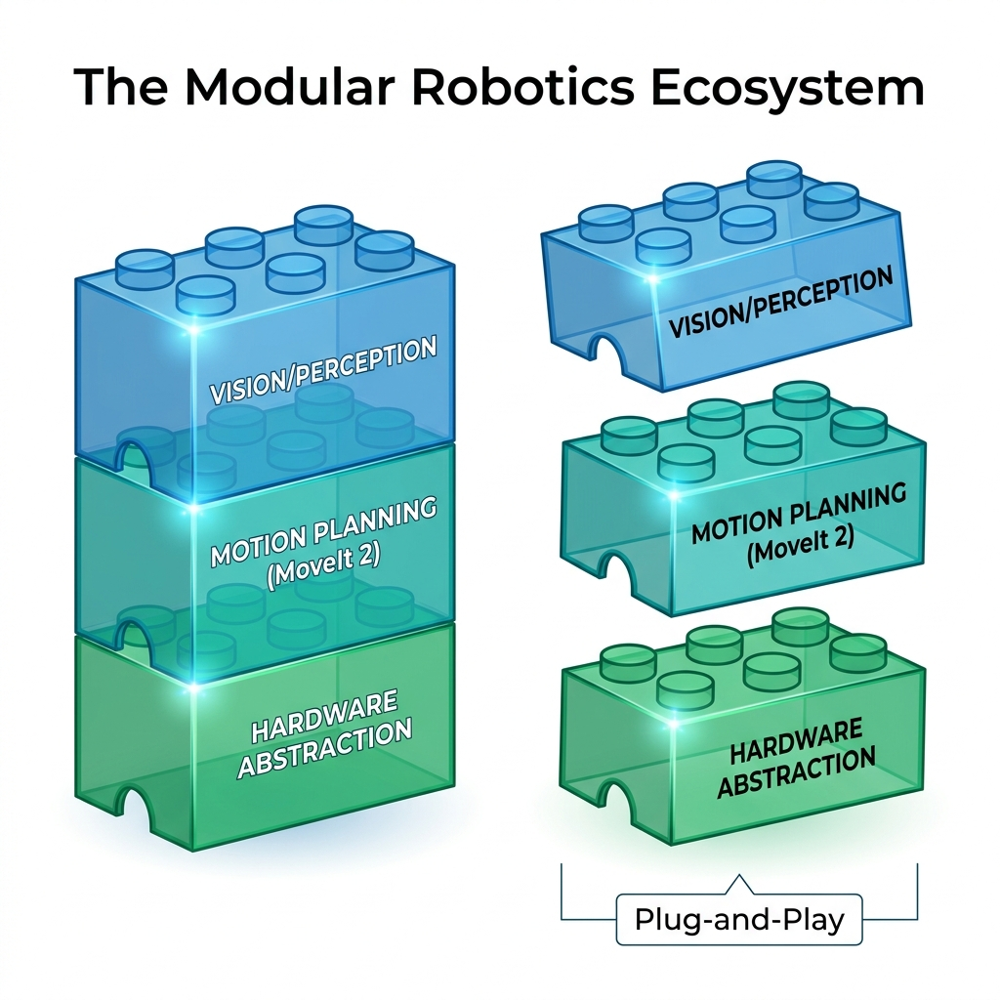

**Talking Points:**
- We don't reinvent the wheel. ROS 2 gives us access to massive, battle-tested libraries.
- **MoveIt 2** for motion planning — used in NASA, Boston Dynamics, and surgical robots.
- **kinect2-ros2** driver for the camera. **Gazebo** for simulation. **RViz** for visualization.
- Each of these plugs into our project like a Lego block — because they all speak the same ROS 2 message standard.

---

### Slide 16 — Simulation & Visualization: The Digital Twin

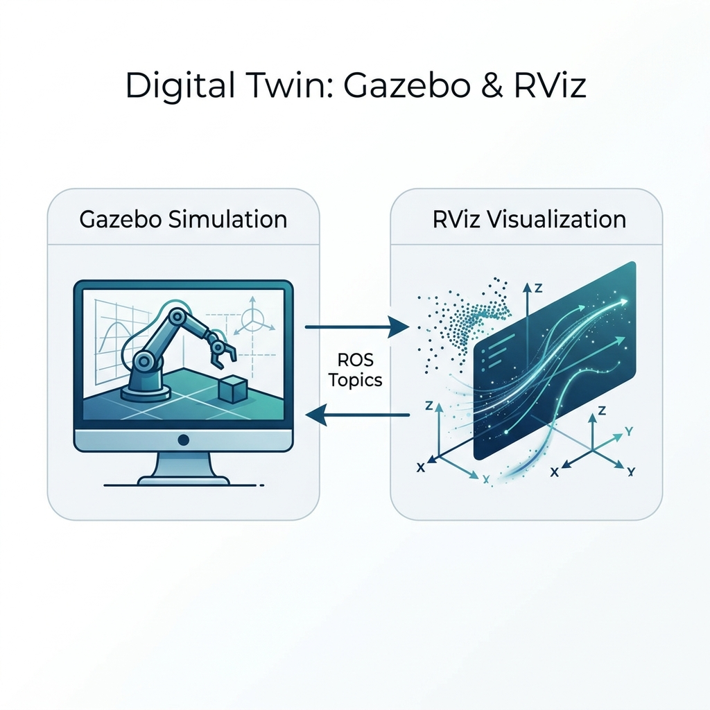

**Talking Points:**
- **Gazebo**: A physics-based simulator. Before touching the physical robot, we validated the *entire* pipeline — from camera image to arm movement — in simulation. Safe, repeatable, and free.
- **RViz**: A real-time visualization tool. We can see exactly what the robot "thinks": the 3D point clouds from the Kinect, the YOLO detection bounding boxes, the planned trajectory path, and the robot's current joint state — all live.
- This is how we caught bugs *before* they could break hardware.

---

## SECTION 3: Technical Deep-Dive — The ASPIRE Pipeline

### Slide 17 — Vision Perception Pipeline: The Eyes of ASPIRE

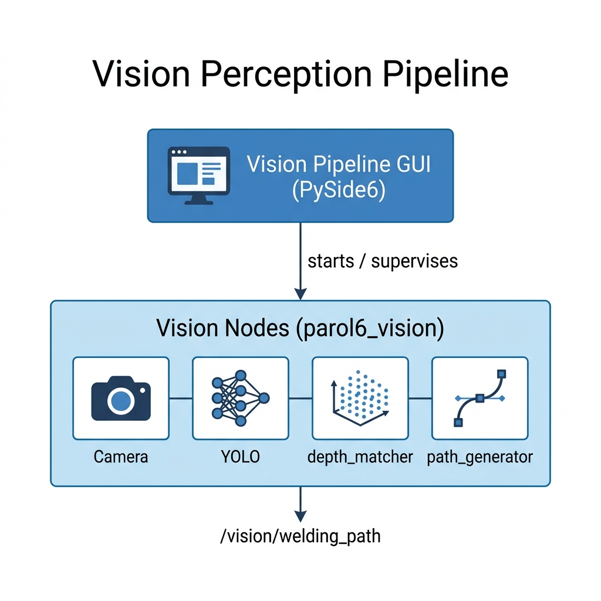

**Talking Points:**
- The pipeline starts at the **PySide6 GUI** — the operator selects a detection mode and triggers capture.
- **Kinect v2** acquires a synchronized RGB + Depth frame pair.
- The RGB image is passed to **YOLOv8** which returns a pixel-level segmentation mask of the weld seam.
- The mask is projected onto the depth map by **depth_matcher_node**, converting 2D pixels to real (X, Y, Z) coordinates in meters.
- **path_generator_node** applies PCA to find the seam direction, then fits a smooth **B-Spline** curve through the 3D points to produce the final welding trajectory.

---

### Slide 18 — From 2D Pixels to 3D Space (Math Behind Vision)

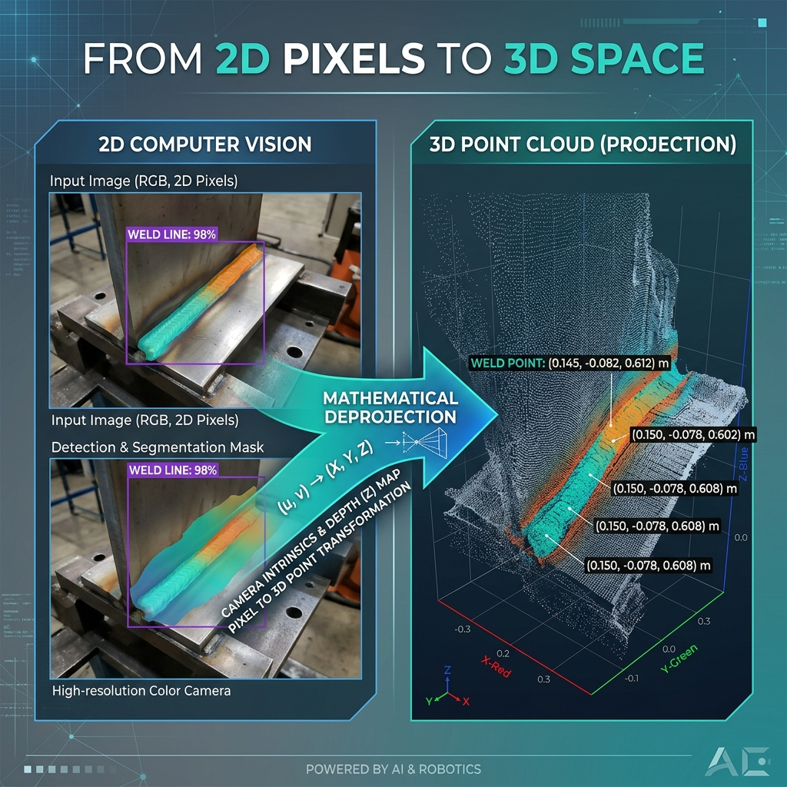

**Talking Points:**
- YOLO gives us 2D pixel coordinates (u, v). The robot needs real-world 3D coordinates (X, Y, Z) in meters.
- **Mathematical Deprojection**: Using the camera's intrinsic calibration matrix (focal length, principal point) and the depth value from the Kinect, we back-project every masked pixel into 3D space.
- This gives us a raw 3D point cloud of the weld seam region. The `depth_matcher_node` handles this transformation inside the ROS pipeline.

---

### Slide 19 — Path Optimization: PCA & B-Spline Smoothing

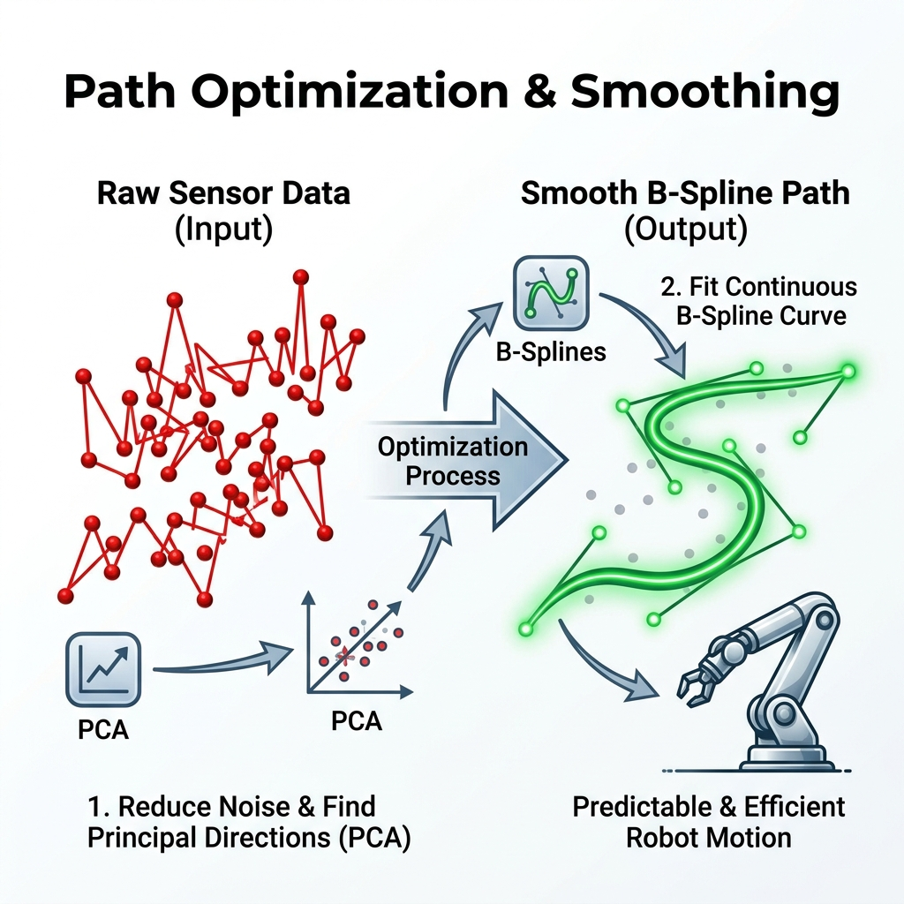

**Talking Points:**
- Raw point clouds from a depth sensor are noisy. Sending jagged points to a robot would cause violent motor jerking and a poor weld.
- **PCA (Principal Component Analysis)**: Finds the mathematical "direction of the seam" through all the points, ordering them from start to end in the correct physical direction.
- **B-Spline Fitting**: A smooth parametric curve is fitted through the ordered points. The result is a mathematically continuous, differentiable welding path — guaranteeing smooth robot motion at every intermediate point.

---

### Slide 20 — MoveIt 2: The Collision-Free Navigation System

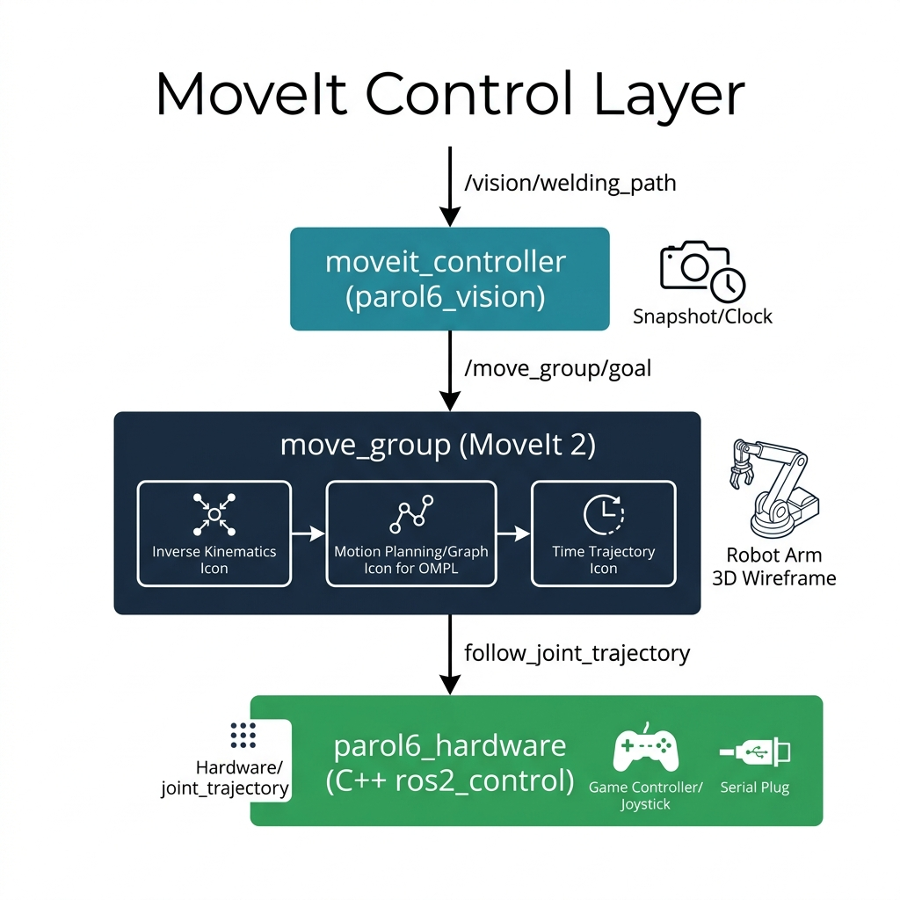

**Talking Points:**
- The `moveit_controller` node receives the 3D Cartesian welding path and submits it to the **MoveIt 2 Motion Planning Stack**.
- **Inverse Kinematics (IK)**: MoveIt solves the mathematical problem of "which joint angles produce this Cartesian pose?" for every point on the path.
- **OMPL Planning**: The OMPL motion planner searches for a joint-space trajectory that connects the start to the goal while avoiding all known collision objects (table, workpiece, robot links).
- The result is a time-parameterized joint trajectory that is **mathematically guaranteed to be collision-free before a single motor moves**.

---

### Slide 21 — Collision Avoidance & Safety

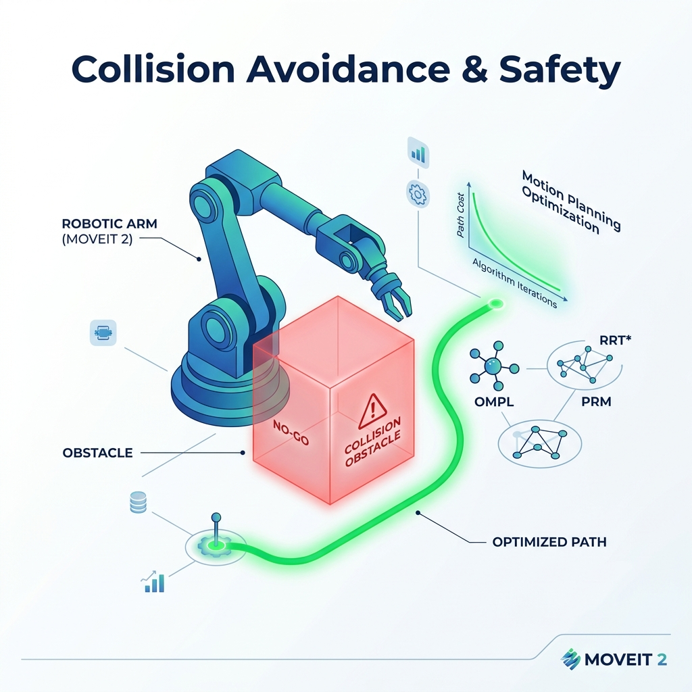

**Talking Points:**
- A 6-DOF arm has infinite joint configurations that can reach the same Cartesian point. Many of them cause self-collision or table collisions.
- ASPIRE uses a **Collision Scene** in MoveIt — a 3D model of the environment (table, tool, workpiece). Every potential trajectory is checked against this model before execution.
- **Fail-safe conditions**: The system also monitors for TF (Transform) timeouts, kinematic singularities, and joint limit violations. On any anomaly, execution stops immediately and an error is raised.

---

## SECTION 4: The Hardware Bridge — Connecting Software to Physical Steel

### Slide 22 — What Is the Hardware Bridge?

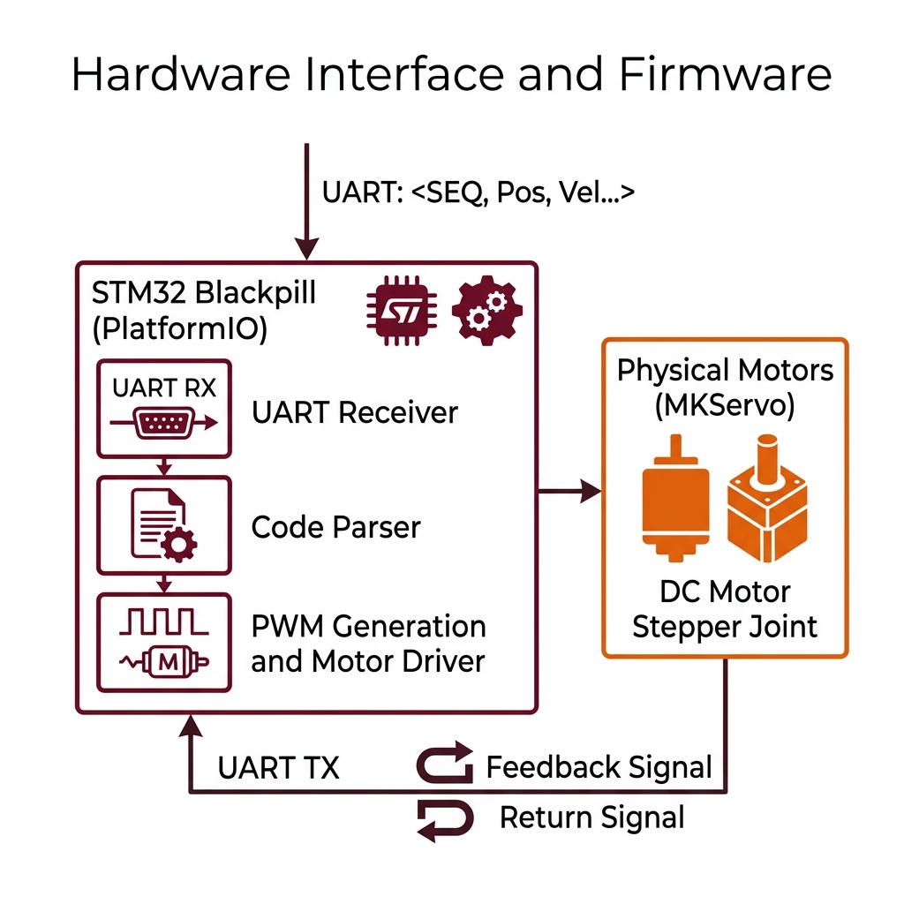

**Talking Points:**
- The **Hardware Bridge** is the most critical and least visible component of ASPIRE.
- It is a **C++ `ros2_control` Hardware Interface Plugin** — a purpose-built class that derives from `hardware_interface::SystemInterface`.
- It is the only component that physically controls the robot. Without it, MoveIt has nowhere to send commands.
- The plugin is loaded dynamically at runtime via `pluginlib`, so it can be swapped or upgraded without modifying any other part of the stack.
- The bridge has three responsibilities in every 40ms cycle:
  1. **`write()`** — Serialize joint commands from MoveIt into a UART packet and send them to the STM32.
  2. **`read()`** — Parse ACK feedback from the STM32 and update the joint state for the controller.
  3. **Bookkeeping** — Track sequence numbers, detect packet loss, and monitor timing.

---

### Slide 23 — Lifecycle: From Boot to Active

**Talking Points (Managed Lifecycle — 4 stages):**
- **`on_init()`**: Called once at load. Reads `serial_port` and `baud_rate` from the URDF hardware parameters. Validates that exactly 6 joints are configured. Also calls `std::setlocale(LC_NUMERIC, "C")` — a critical fix: on Arabic/Turkish/European locale systems, `%.3f` formatting uses a comma as the decimal separator, which corrupts the serial packet since commas are field delimiters. This one bug could silently break all motor communication.
- **`on_configure()`**: Opens the serial port using `LibSerial`. Sets `115200 baud, 8N1, no flow control`, and a 100ms read timeout. If the port fails to open and `allow_spoofing` is not set, the system fails fast rather than running silently with no hardware.
- **`on_activate()`**: The most complex stage. Before allowing MoveIt to send any commands, the bridge:
  1. Waits up to 1 second for the first real encoder feedback from the STM32 to arrive.
  2. Snaps the "command" positions to match the physical positions — preventing a violent "jump" on first write.
  3. Sends a `<HOME>` command and then **waits up to 90 seconds** for the homing sequence to fully complete (15 sec/joint). Only after homing finishes are controllers allowed to start. This prevents the controller from locking onto pre-homing states and violently yanking the arm during startup.
- **`on_deactivate()`**: Signals a clean stop. Motors cease receiving new targets.

---

### Slide 24 — The Timing Problem: Why a Dedicated Bridge Is Needed

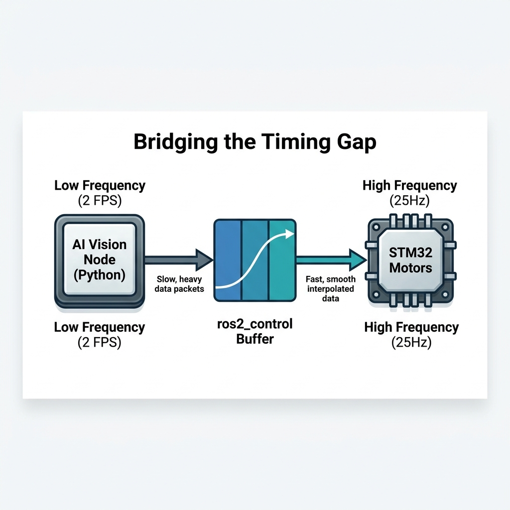

**Talking Points:**
- **The core conflict**: The `JointTrajectoryController` in ROS 2 calls `write()` at a fixed **25Hz** (every 40ms). This clock is non-negotiable — the motors need deterministic updates.
- **The AI's slowness**: The vision pipeline and MoveIt planning can take seconds. The bridge buffers the trajectory waypoints and trickles them out at exactly 25Hz, completely isolating the hardware from the computing delays.
- **The UART bottleneck**: At 115200 baud, one 60-byte command packet takes approximately **4–5 milliseconds** to transmit. This must fit within the 40ms window — and it does, with comfortable margin.
- **Homing block**: During the homing phase, `write()` silently returns `OK` without sending any trajectory commands. This prevents the controller from fighting the firmware's homing motion.

---

### Slide 25 — The Wire Protocol: Exact Packet Format

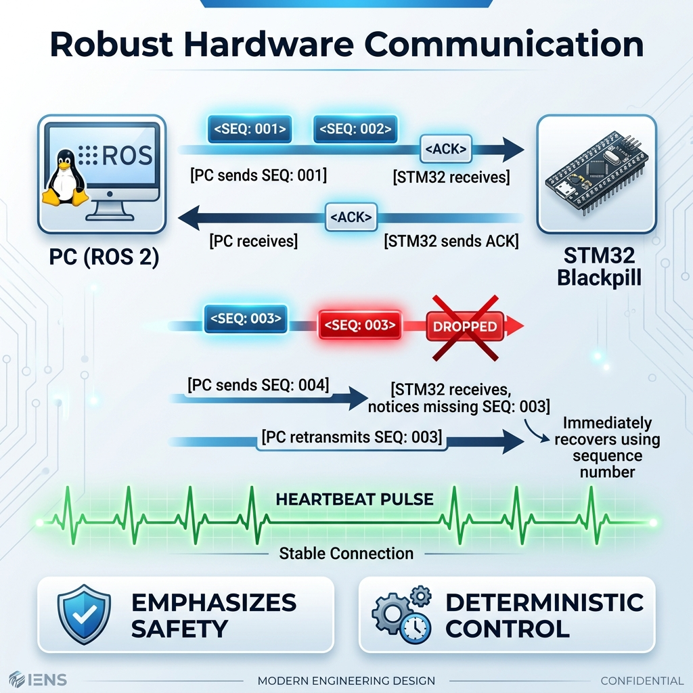

**Talking Points:**
**TX Command (PC --> STM32) every 40ms:**
```
<SEQ, J1_pos, J1_vel, J2_pos, J2_vel, J3_pos, J3_vel, J4_pos, J4_vel, J5_pos, J5_vel, J6_pos, J6_vel>\n
```
- 13 fields: 1 sequence counter + 6 joints x (position_deg, velocity_rad/s)
- All floats formatted to 3 decimal places using `%.3f`
- Wrapped in `<` and `>` angle brackets, terminated with newline

**RX Feedback (STM32 --> PC) every ~40ms:**
```
<ACK, SEQ, J1_pos, J1_vel, J2_pos, J2_vel, J3_pos, J3_vel, J4_pos, J4_vel, J5_pos, J5_vel, J6_pos, J6_vel, H#>\n
```
- 15 fields: ACK header + SEQ echo + 12 joint state values + homing status (`H0`=idle, `H1`=in-progress, `H2`=complete, `H3`=error)
- The RX parser handles CRLF line endings, accumulates partial packets across control cycles using a static ring buffer, always uses the **newest complete packet** if multiple arrive in one 40ms window.

---

### Slide 26 — Safety Features Built Into the Bridge

**Talking Points:**
- **Wraparound-safe sequence tracking**: The SEQ counter is a `uint32_t`. Loss detection correctly handles wraparound at `UINT32_MAX --> 0` without counting it as a loss event.
- **Packet loss quantification**: Small gaps (< 10 packets) are normal — the RX loop drains the USB buffer and intentionally uses only the newest packet, discarding stale intermediates. Gaps > 10 are logged as warnings with exact counts.
- **RX buffer overflow protection**: If the buffer exceeds 4096 bytes without a newline (e.g., firmware reset flood), the buffer is cleared and a throttled warning is logged. The controller continues running.
- **Per-joint direction sign correction**: Each joint has a `dir_sign` (+1.0 or -1.0) loaded from the URDF `ros_invert` xacro parameter. Both TX commands and RX feedback are multiplied by this sign, ensuring the software always works in a consistent coordinate frame regardless of physical motor installation orientation.
- **Latency tracking**: The bridge records the maximum inter-packet delay (`max_rx_period_ms_`) across the entire session. This is logged every 5 minutes as **validated thesis performance evidence**.
- **Statistics reporting**: Packets received, lost, and parse errors are tracked by counters and reported as a loss percentage. At 25Hz over a 60-second weld, we expect 1500 packets; loss < 0.5% is considered nominal.

---

### Slide 27 — The Full ASPIRE System Architecture

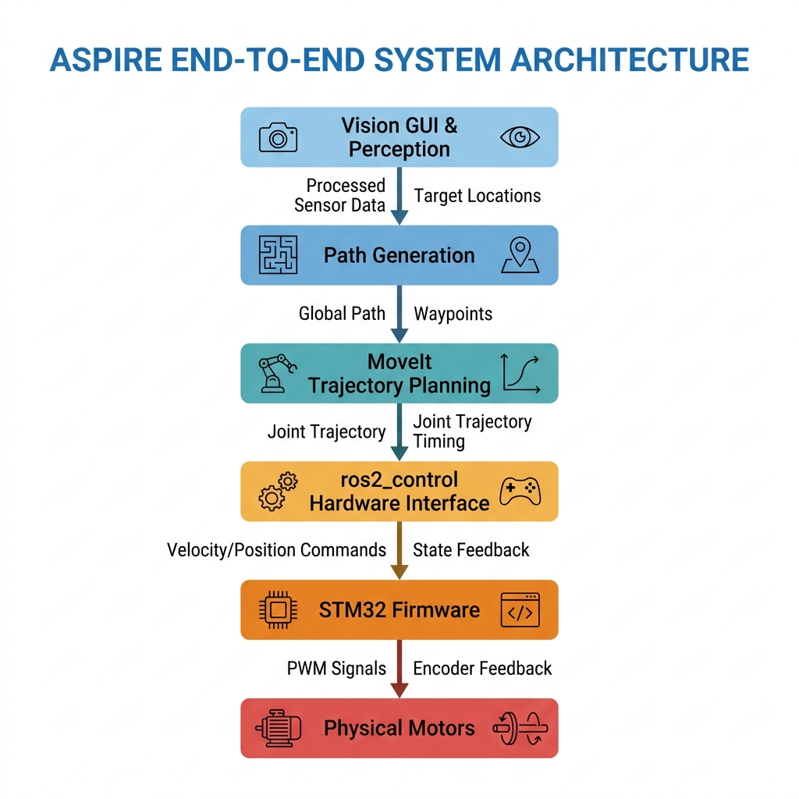

**Talking Points:**
- This is the complete end-to-end picture. From operator input to physical steel movement.
- **Data flow** (top → bottom):
  - **GUI** → triggers camera capture
  - **Vision Nodes** → YOLO + Depth → 3D Path
  - **MoveIt Controller** → IK + Collision Check → Joint Trajectory
  - **C++ Hardware Bridge** → Serialized UART Packets → STM32
  - **STM32 Firmware** → FOC Motor Commands → Physical Motion
- Every arrow in this diagram is a real, tested communication channel in the ASPIRE system.

---

### Slide 27 — Bridging the Timing Gap (ros2_control Summary)

**Talking Points:**
- To summarize the hardware bridge's value proposition:
  - ✅ Decouples AI intelligence from real-time execution
  - ✅ Provides a deterministic 25Hz control loop
  - ✅ Implements reliable, ACK-based UART communication
  - ✅ Monitors hardware heartbeat for emergency safe-stop
  - ✅ Translates abstract joint angles to physical motor commands
- This bridge is **what makes ASPIRE an industrial system** rather than just an academic demo.

---

## SECTION 5: Engineering Triumphs — Challenges Solved

### Slide 28 — Making AI Usable: The ASPIRE GUI

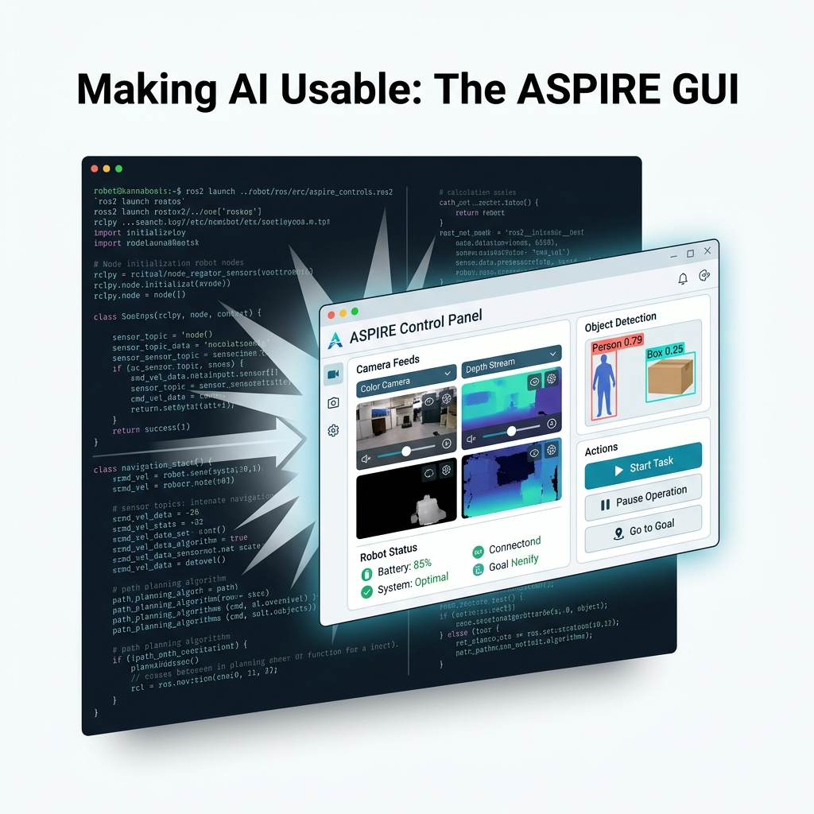

**Talking Points:**
- **The Challenge**: Running ASPIRE from the command line would require launching 8+ separate ROS nodes, each with complex parameters. No non-expert could operate it.
- **The Solution**: A **PySide6 GUI** that wraps the entire ROS 2 backend. With a single button click, the operator can: launch all nodes, trigger perception, preview the planned path, and execute the weld.
- This is what "productizing" a research system looks like — making cutting-edge AI accessible to a factory floor operator.

---

### Slide 29 — Future Scalability: The Power of Open Architecture

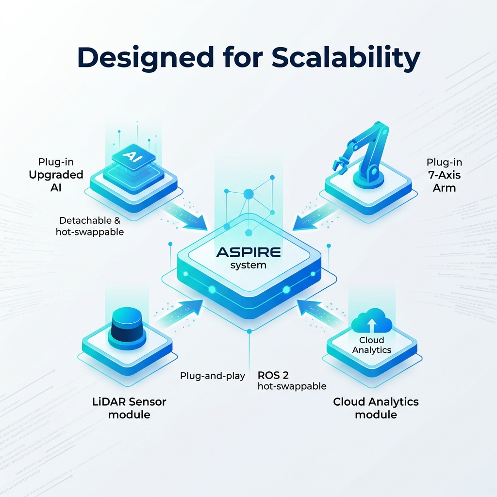

**Talking Points:**
- Because ASPIRE is built on modular ROS 2 nodes, future upgrades are surgical — not a full rebuild.
  - **Upgraded AI**: Swap `yolo_node` for a newer segmentation model without touching any other component.
  - **7-Axis Arm**: Update the URDF, retrain MoveIt's kinematics — the vision and hardware layers are unchanged.
  - **LiDAR Sensor**: Replace the Kinect with a LiDAR by adding a new driver node — the rest of the pipeline stays the same.
- This is the long-term industrial value of investing in a **standards-based, open-source middleware** like ROS 2 from day one.

---

*End of Presentation Guide — 29 Slides Total*
*ASPIRE | Autonomous System for Path Identification and Robotic Execution*
