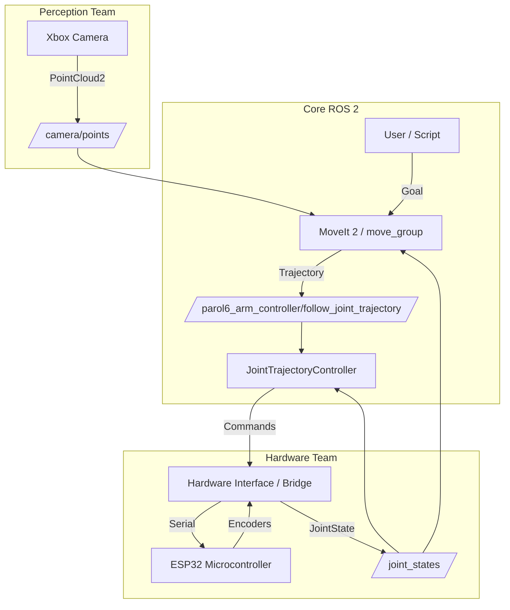

# 📡 PAROL6 Topics & Services Documentation

This document outlines the core ROS 2 topics, services, and nodes for the PAROL6 robot. Use this guide to integrate your specific modules (Hardware/ESP32, Perception/Camera, etc.).

---

## 🧠 1. Core Control System (MoveIt & ROS 2 Control)

The core system uses **MoveIt 2** for motion planning and **ROS 2 Control** for executing commands.

### **Key Nodes**
- **`move_group`**: The main MoveIt node. It plans paths and checks collisions.
- **`ros2_control_node`**: Manages the hardware interface and controllers.
- **`parol6_arm_controller`**: The specific controller instance moving the arm.

### **Key Topics & Actions**

| Interface Type | Name | Message Type | Description |
| :--- | :--- | :--- | :--- |
| **Action Server** | `/parol6_arm_controller/follow_joint_trajectory` | `control_msgs/action/FollowJointTrajectory` | **Main Control Interface.** Send trajectory goals here to move the robot. MoveIt uses this automatically. |
| **Topic** | `/parol6_arm_controller/joint_trajectory` | `trajectory_msgs/msg/JointTrajectory` | **Direct Control.** You can publish trajectories here directly (bypassing MoveIt) for simple movements. |
| **Topic** | `/joint_states` | `sensor_msgs/msg/JointState` | **Feedback.** Real-time position/velocity/effort of all joints. |
| **Topic** | `/dynamic_joint_states` | `control_msgs/msg/DynamicJointState` | Detailed controller state feedback. |

---

## 🔌 2. Hardware Layer (ESP32 Team)

For the team connecting the physical robot (ESP32) to ROS 2.

### **Objective**
You need to close the loop: **Receive Motor Commands** from ROS and **Send Joint Feedback** to ROS.

### **Integration Methods**

#### **Method A: The Professional Way (Hardware Interface)**
Write a C++ `SystemInterface` plugin for `ros2_control`.
- **Input:** Read `info.command_interfaces` (Position commands from Controller).
- **Output:** Write to `info.state_interfaces` (Current Position from Encoders).
- **Communication:** Your C++ code talks to ESP32 via Serial/UART.

#### **Method B: The "Bridge Node" Way (Easier for Prototyping)**
Create a Python/C++ node that bridges ROS topics and Serial.

1.  **Feedback (Robot -> ROS):**
    -   **Publish to:** `/joint_states`
    -   **Message:** `sensor_msgs/msg/JointState`
    -   **Data:** `name`=['joint_L1', ...], `position`=[rad1, ...], `header.stamp`=now()
    -   *Note:* You must disable the `joint_state_broadcaster` in simulation if you run this on the real robot to avoid conflicts.

2.  **Control (ROS -> Robot):**
    -   **Subscribe to:** `/parol6_arm_controller/joint_trajectory`
    -   **Logic:** When a message arrives, parse the `points` and send the target positions to the ESP32.

---

## 👁️ 3. Perception & Vision (Xbox Camera Team)

For the team integrating 3D cameras (Kinect/Xbox) for collision avoidance and object detection.

### **Objective**
Provide 3D data to MoveIt so it can avoid obstacles or find targets.

### **Topics to Publish**

| Topic Name | Message Type | Purpose |
| :--- | :--- | :--- |
| `/camera/points` | `sensor_msgs/msg/PointCloud2` | **3D Point Cloud.** The raw 3D data from the camera. MoveIt's Octomap updater listens to this. |
| `/camera/image_raw` | `sensor_msgs/msg/Image` | **2D Video Feed.** Standard RGB video. |
| `/camera/depth/image_raw` | `sensor_msgs/msg/Image` | **Depth Map.** Distance data for each pixel. |

### **MoveIt Integration**
To make the robot avoid obstacles seen by the camera:
1.  Publish your PointCloud to `/camera/points`.
2.  We will need to update `sensors_3d.yaml` in the MoveIt config to "listen" to this topic.
3.  MoveIt will automatically build an **Octomap** (3D voxel map) of the environment.

---

## 📊 4. System Data Flow Diagram



---

## 📝 Joint Names Reference
Ensure everyone uses these **exact** names:
1. `joint_L1` (Base)
2. `joint_L2` (Shoulder)
3. `joint_L3` (Elbow)
4. `joint_L4` (Wrist Pitch)
5. `joint_L5` (Wrist Yaw)
6. `joint_L6` (Wrist Roll)

---

## 🛠️ Quick Testing Commands

**Check if Controller is listening:**
```bash
ros2 topic list | grep parol6
```

**Echo Joint States (See what the robot thinks it is):**
```bash
ros2 topic echo /joint_states
```

**Send a Test Command (Directly):**
```bash
ros2 topic pub --once /parol6_arm_controller/joint_trajectory trajectory_msgs/msg/JointTrajectory "{joint_names: [joint_L1, joint_L2, joint_L3, joint_L4, joint_L5, joint_L6], points: [{positions: [0.0, 0.0, 0.0, 0.0, 0.0, 0.0], time_from_start: {sec: 2}}]}"
```
