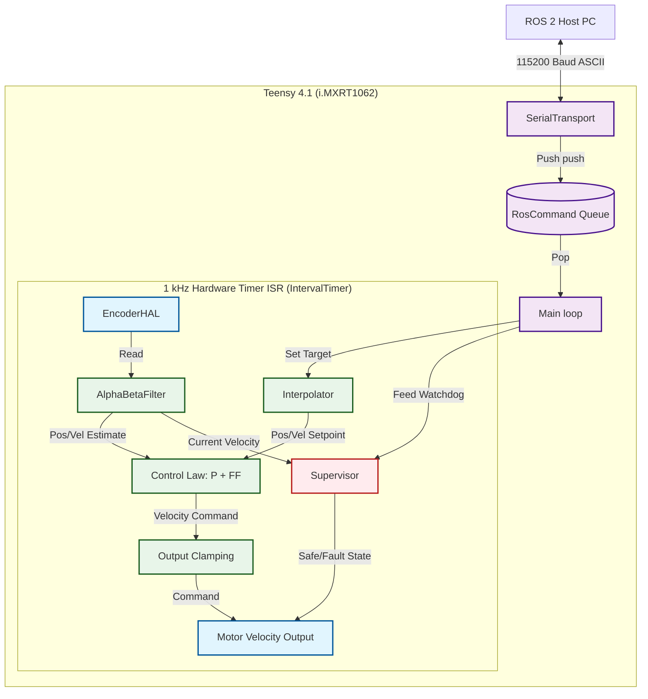
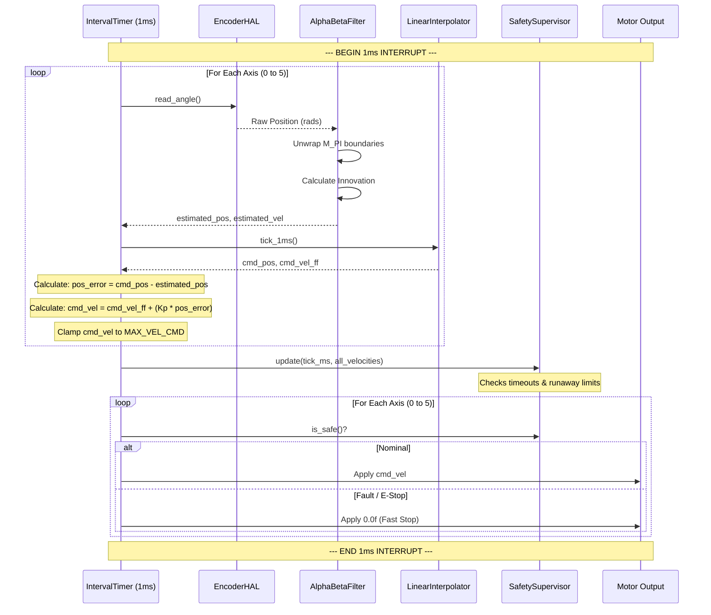

# Firmware Architecture & Data Flow

This document visualizes the hard real-time architecture of the PAROL6 Teensy 4.1 firmware.

## 1. Top-Level Module Relationships

The firmware is designed around a strict separation of concerns, decoupling the asynchronous ROS 2 communication from the highly deterministic 1 kHz control mathematics.

## 2. The 1 kHz ISR Execution Pipeline

The 1 ms tick is the heart of the system. To guarantee jitter remains $< 50$ µs, the execution sequence inside the `run_control_loop_isr()` function is rigidly ordered to compute all math *before* making safety decisions and applying physical outputs.

## 3. Data Ownership & Thread Safety rules

Because the system blends an asynchronous background loop (serial parsing) with a pre-emptive foreground ISR (hardware timer), data ownership is strictly enforced to prevent race conditions without relying on heavy RTOS mutexes taking down the ISR.

*   **`CircularBuffer<RosCommand>`**: Acts as the sole locking boundary. The `MainLoop` owns pushing. `MainLoop` temporarily calls `noInterrupts()` to pop items safely before the ISR can strike. 
*   **`Interpolator`**: Owned by the ISR (`tick_1ms`). Setpoints (`set_target`) are injected by the `MainLoop` only during the safe periods between queue pops.
*   **`AlphaBetaFilter`**: Exclusively owned by the ISR. The `MainLoop` is allowed to *read* the state (for background 10 Hz telemetry) but must wrap the read in `noInterrupts()` to prevent reading a torn float if the 1ms tick interrupts the copy operation.
