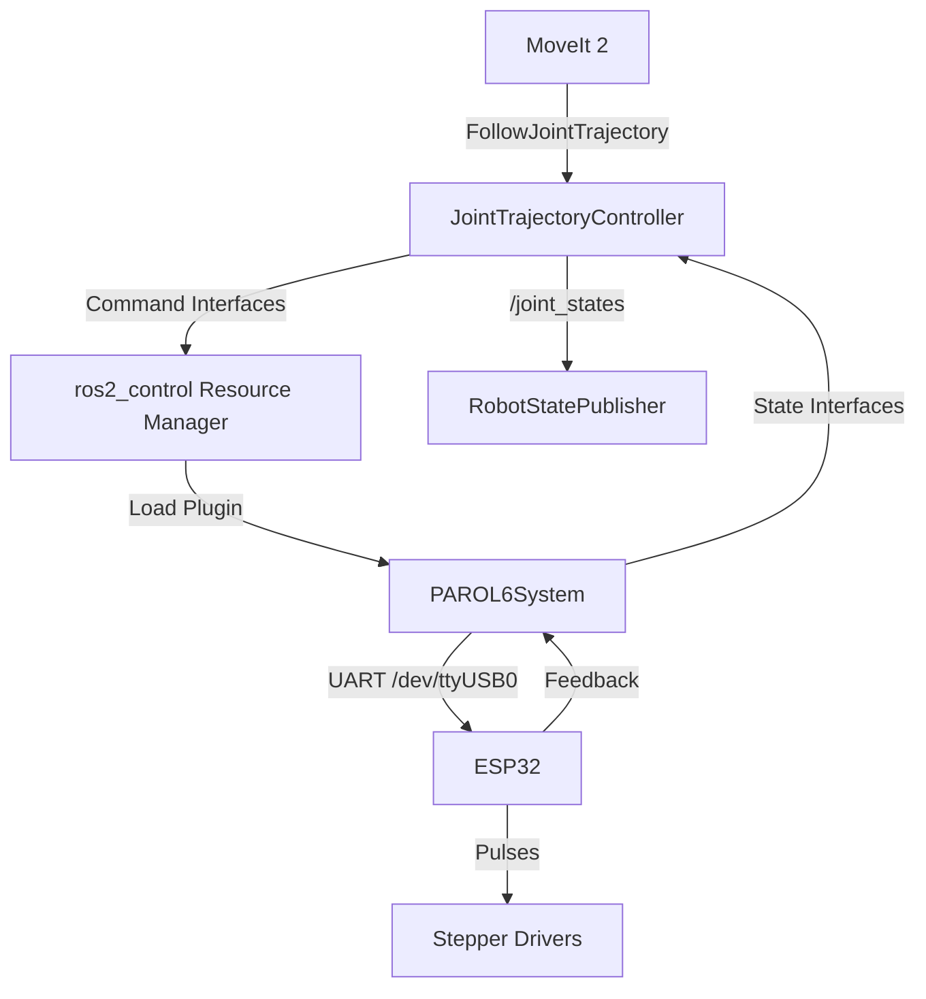

# PAROL6 Hardware Interface Developer Guide

## 1. 🏗️ Architecture Overview

The `parol6_hardware` package implements a `ros2_control` **SystemInterface** plugin. It acts as the bridge between the high-level controllers (FollowJointTrajectory) and the low-level ESP32 firmware.



### Key Components

- **SystemInterface:** The base class we inherit from.
- **Lifecycle Management:** Handles state transitions (Unconfigured → Inactive → Active).
- **Read/Write Loop:** The real-time control loop running at 25 Hz.

---

## 2. 🧩 Class Structure

**File:** `include/parol6_hardware/parol6_system.hpp`

```cpp
class PAROL6System : public hardware_interface::SystemInterface
{
public:
  // Lifecycle Methods
  CallbackReturn on_init(const HardwareInfo & info) override;
  CallbackReturn on_configure(const State & previous_state) override;
  CallbackReturn on_activate(const State & previous_state) override;
  CallbackReturn on_deactivate(const State & previous_state) override;

  // Data Exchange Methods
  std::vector<StateInterface> export_state_interfaces() override;
  std::vector<CommandInterface> export_command_interfaces() override;

  // Real-time Loop Methods
  return_type read(...) override;
  return_type write(...) override;

private:
  // Hardware Resources
  std::unique_ptr<serial::Serial> serial_;  // Added in Day 2
  rclcpp::Logger logger_;

  // Data Buffers
  std::vector<double> hw_commands_;    // Target positions
  std::vector<double> hw_states_pos_;  // Actual positions
  std::vector<double> hw_states_vel_;  // Actual velocities
};
```

---

## 3. 🔄 Lifecycle State Machine

We rigorously follow the `rclcpp_lifecycle` state machine to ensure safety.

| State Transition | Method | Action Taken |
|------------------|--------|--------------|
| **Load Plugin** | `on_init` | Allocate vectors, read URDF params, init logger. <br> *No hardware access.* |
| **Unconfigured → Inactive** | `on_configure` | **Open Serial Port.** Verify connection to ESP32. <br> *Fail if port busy or ESP32 silent.* |
| **Inactive → Active** | `on_activate` | Enable motors (if implemented). Start command stream. <br> *Reset command buffer to current state.* |
| **Active → Inactive** | `on_deactivate` | **Stop Motors.** Stop sending commands. <br> *Keep serial open.* |
| **Inactive → Unconfigured** | `on_cleanup` | Close Serial Port. Free resources. |

---

## 4. ⏱️ Real-Time Loop (25 Hz)

The `controller_manager` calls `read()` and `write()` cyclically.

### `read()`
**Goal:** strict execution time < 2ms

1.  Check `serial_->available()`
2.  If data exists: `readline()`
3.  Parse format: `<Seq, J1, J2, J3, J4, J5, J6>` (Day 3+)
4.  Update `hw_states_pos_` and `hw_states_vel_` vectors.

### `write()`
**Goal:** strict execution time < 2ms

1.  Format string: `<Seq, Cmd1, Cmd2, Cmd3, Cmd4, Cmd5, Cmd6>`
2.  Use `%.2f` precision for bandwidth optimization.
3.  `serial_->write(cmd_string)`
4.  **Critical:** Do NOT wait for acknowledgement (non-blocking).

### ⏲️ Timing Budget Allocation

Deterministic timing is critical for real-time control. The 25 Hz loop (40ms period) is allocated as follows:

| Component | Budget | Notes |
|-----------|--------|-------|
| Controller Manager scheduling | ~5 ms | Framework overhead |
| `read()` execution | < 2 ms | Serial receive + parse |
| `write()` execution | < 2 ms | Format + serial transmit |
| Serial driver overhead | < 1 ms | Kernel + USB stack |
| **Safety margin** | ~30 ms | Handles system load spikes |
| **Total loop period** | 40 ms | 25 Hz |

**Enforcement:**
- Any sustained violation of these budgets **must block hardware deployment**.
- Timing guards in `read()`/`write()` log warnings if > 5ms.
- Performance testing required before increasing update rate.

**Day 1 SIL Results:** 0.28ms jitter validates budget compliance.

---

## 5. 🛠️ Extension Guide

### Adding Velocity Command Interface (Future)

1.  **Update URDF:**
    Add `<command_interface name="velocity"/>` to `parol6.ros2_control.xacro`.

2.  **Update Config:**
    Add `velocity` to `command_interfaces` in `parol6_controllers.yaml`.

3.  **Update Header:**
    Add `std::vector<double> hw_commands_vel_;`

4.  **Update `on_init`:**
    Resize `hw_commands_vel_`.

5.  **Update `export_command_interfaces`:**
    Export the new interface pointers.

### Tuning Update Rate

1.  Modify `config/parol6_controllers.yaml`:
    ```yaml
    controller_manager:
      ros__parameters:
        update_rate: 50  # Change 25 to 50
    ```
2.  **Verify:** Check CPU usage and serial bandwidth before increasing.

---

## 6. 🐛 Debugging Tips

### Fake Hardware Mode (Day 1)
Currently, `read()` returns `OK` without doing anything. This is legitimate for checking:
- Topic publishing
- Controller activation
- TF tree validity

### Serial Debugging (Day 2+)
- Use `minicom -D /dev/ttyUSB0 -b 115200` to inspect raw ESP32 data.
- **Note:** Close minicom before launching ROS, or the port will be busy!

---

**Version:** 1.0.0 (Day 1 SIL)
**Author:** PAROL6 Team
