# PAROL6 Vision Pipeline — Full Developer Guide

> **Generated:** 2026-03-26  
> **Branch:** current working branch (do not merge `main` unless explicitly asked)  
> **Primary files:** `parol6_vision/scripts/vision_pipeline_gui.py` · `parol6_vision/parol6_vision/`

---

## Table of Contents

1. [System Architecture](#1-system-architecture)
2. [Node Inventory & Interfaces](#2-node-inventory--interfaces)
3. [ROS Topics Reference](#3-ros-topics-reference)
4. [ROS Services Reference](#4-ros-services-reference)
5. [Config Files](#5-config-files)
6. [GUI Architecture & Code Patterns](#6-gui-architecture--code-patterns)
7. [Full Operator Workflow](#7-full-operator-workflow)
8. [Kinect GPU Regression — Root Cause & Fix](#8-kinect-gpu-regression--root-cause--fix)
9. [Bug Fixes Applied (All Sessions)](#9-bug-fixes-applied-all-sessions)
10. [Debugging Commands](#10-debugging-commands)
11. [Environment Setup](#11-environment-setup)
12. [AI Handoff Prompt](#12-ai-handoff-prompt)

---

## 1. System Architecture

### Pipeline Flow

```mermaid
flowchart LR
    KIN["kinect2_bridge\nQHD Camera"]
    CAP["capture_images\nNode"]
    CROP["crop_image\nNode"]
    MODE["Processing Mode\n(YOLO / Color / Manual)"]
    OPT["path_optimizer\nNode"]
    DM["depth_matcher\nNode"]
    PG["path_generator\nNode"]
    MI["moveit_controller\nNode"]

    KIN -->|"/kinect2/qhd/image_color_rect\n/kinect2/qhd/image_depth_rect\n/kinect2/qhd/camera_info"| CAP
    CAP -->|"/vision/captured_image_raw\n/vision/captured_image_depth\n/vision/captured_camera_info"| CROP
    CROP -->|"/vision/captured_image_color"| MODE
    MODE -->|"/vision/processing_mode/annotated_image"| OPT
    OPT -->|"/vision/weld_lines_2d"| DM
    DM -->|"/vision/weld_lines_3d"| PG
    PG -->|"/vision/welding_path"| MI
```



### Physical node layout

| Stage | Node | File |
|-------|------|------|
| 1a | kinect2_bridge | External package (`/opt/kinect_ws`) |
| 1b | capture_images | `parol6_vision/capture_images_node.py` |
| 1c | crop_image | `parol6_vision/crop_image_node.py` |
| 2 | color_mode **or** yolo **or** Manual | `color_mode.py` · `yolo_segment.py` · `manual_line_aligner_node.py` |
| 3a | path_optimizer | `parol6_vision/path_optimizer.py` |
| 3b | depth_matcher | `parol6_vision/depth_matcher.py` |
| 3c | path_generator | `parol6_vision/path_generator.py` |
| 4 | moveit_controller | `parol6_vision/moveit_controller.py` |

---

## 2. Node Inventory & Interfaces

### 2.1 kinect2_bridge

**Launch command (from GUI):**
```bash
ros2 launch ~/Desktop/PAROL6_URDF/kinect2_bridge_gpu.yaml
```

**Config:** `kinect2_bridge_gpu.yaml` (workspace root)

**Key parameters:**
| Parameter | Type | Recommended | Notes |
|-----------|------|-------------|-------|
| `depth_method` | string | `opencl` | `cpu` causes regression to ~0.3 Hz |
| `reg_method` | string | `opencl_cpu` | `opencl` if GPU RAM allows |
| `fps_limit` | float | `15.0` | Hardware max for QHD is 15 Hz |
| `bilateral_filter` | bool | `true` | Expensive on CPU; OK on GPU |
| `edge_aware_filter` | bool | `true` | CPU cost very high |
| `worker_threads` | int | `4` | Parallelism for depth processing |

**Published topics:** `/kinect2/qhd/image_color_rect`, `/kinect2/qhd/image_depth_rect`, `/kinect2/qhd/camera_info`

---

### 2.2 capture_images

**Entry point:** `ros2 run parol6_vision capture_images`

**Parameters:**
| Parameter | Type | Default | Description |
|-----------|------|---------|-------------|
| `capture_mode` | string | `keyboard` | `keyboard` or `timed` |
| `frame_time` | float | `10.0` | Seconds between auto-publishes (timed mode) |
| `output_topic` | string | `/vision/captured_image_raw` | Output colour topic |

**Subscribed:**
- `/kinect2/qhd/image_color_rect` (synchronized with depth)
- `/kinect2/qhd/image_depth_rect` (synchronized with color)
- `/kinect2/qhd/camera_info`
- `/vision/capture_trigger` (`std_msgs/Empty`) — GUI fallback trigger

**Published:**
- `/vision/captured_image_raw` (colour, via `output_topic`)
- `/vision/captured_image_depth`
- `/vision/captured_camera_info`

**Capture trigger flow:**
1. GUI tries `proc.stdin.write("s\n")` (keyboard mode only)
2. Falls back to `ros2 topic pub --once /vision/capture_trigger std_msgs/msg/Empty {}`
3. `_trigger_callback` publishes cached frame pair immediately (no waiting for next sync)

---

### 2.3 crop_image

**Entry point:** `ros2 run parol6_vision crop_image`

**Parameters:**
| Parameter | Type | Default | Description |
|-----------|------|---------|-------------|
| `input_topic` | string | `/vision/captured_image_raw` | Raw image in |
| `output_topic` | string | `/vision/captured_image_color` | Processed image out |
| `config_path` | string | `~/.parol6/crop_config.json` | Config file |
| `roi` | int[4] | unset | `[x,y,w,h]` — **legacy crop mode only** |

**Services:**
| Service | Type | Action |
|---------|------|--------|
| `~/reload_roi` | `std_srvs/Trigger` | Re-read config, republish current frame |
| `~/clear_roi` | `std_srvs/Trigger` | Disable processing → pass-through |

**Modes:**
| Mode | Behaviour | Resolution effect |
|------|-----------|-------------------|
| `mask` ← recommended | Fill pixels outside polygon with `mask_color` | Unchanged ✅ |
| `crop` ← legacy | Crop to bounding box | Shrinks → breaks depth coords ⚠️ |

> **Critical gotcha:** `ros2 param set /crop_image roi` forces **crop mode**, not mask mode. For mask mode: write the config file and call `~/reload_roi`.

---

### 2.4 color_mode

**Entry point:** `ros2 run parol6_vision color_mode`

**Parameters:** `image_topic`, `expand_px` (default 2), `publish_debug` (default true)

**Algorithm:** HSV green/blue segmentation → dilate → intersect → red fill = weld seam

**Subscribed:** `/vision/captured_image_color`

**Published:** `/vision/processing_mode/annotated_image`, `/vision/processing_mode/debug_image`, `/vision/processing_mode/seam_centroid`

---

### 2.5 yolo_segment

**Entry point:** `ros2 run parol6_vision yolo_segment`

**Subscribed:** `/vision/captured_image_color` · **Published:** same 3 topics as `color_mode`

> **Debug image:** Always published, even when fewer than 2 masks are detected. Shows polygon outlines per mask, with a status badge in the top-left corner.

---

### 2.6 manual_line_aligner *(new — Session 3)*

**Entry point:** `ros2 run parol6_vision manual_line_aligner`

**Subscribed:** `/vision/captured_image_color`

**Published:** same 3 topics as `color_mode` + `yolo_segment`:
- `/vision/processing_mode/annotated_image`
- `/vision/processing_mode/debug_image`
- `/vision/processing_mode/seam_centroid`

**Services:**
| Service | Type | Action |
|---------|------|--------|
| `~/set_strokes` | `std_srvs/Trigger` | Fixed mode: load strokes directly from `strokes_json` param |
| `~/teach_reference` | `std_srvs/Trigger` | Adaptive mode: extract ORB features tightly using the `roi_polygon` provided in the JSON, then dynamically track the part geomtrically across live frames. |
| `~/reset_strokes` | `std_srvs/Trigger` | Clear in-memory strokes + delete saved config |

**Parameters:** `stroke_color` (int[3], BGR), `stroke_width` (int), `strokes_json` (str, set before calling services), `publish_debug` (bool)

**Persistent config:** `~/.parol6/manual_aligner_config.json` — loaded automatically on node startup. Uses base64 encoding for massive ORB feature pools to evade param length crash limits.

> **Use case:** Draw the weld seam once. If you also draw a boundary `roi_polygon` in the GUI, the node uses RANSAC + Affine Transform to dynamically rotate and translate the predefined strokes safely if the physical part shifts arbitrarily on the welder's table!

---

### 2.6 Manual Red Line (GUI-only)

- Load image from disk or **📥 Use Latest Cropped Frame** (caches from `/vision/captured_image_color`)
- Draw red strokes on `ManualCanvas` (QGraphicsView)
- **📡 Publish as ROS Image** → cached publisher → `/vision/processing_mode/annotated_image`

---

### 2.7 path_optimizer

**Entry point:** `ros2 run parol6_vision path_optimizer`

**Subscribed:** `/vision/processing_mode/annotated_image`

**Published:** `/vision/weld_lines_2d` (`WeldLineArray`), `/path_optimizer/debug_image`, `/path_optimizer/markers`

**Algorithm:** Red HSV segmentation → morphological cleanup → skeletonization → PCA ordering → Douglas-Peucker → confidence scoring → publish best line

---

### 2.8 depth_matcher

**Entry point:** `ros2 run parol6_vision depth_matcher`

**Subscribed:** `/vision/weld_lines_2d`, `/vision/captured_image_depth`, `/vision/captured_camera_info`

**Published:** `/vision/weld_lines_3d`, `/depth_matcher/markers`

---

### 2.9 path_generator

**Entry point:** `ros2 run parol6_vision path_generator`

**Subscribed:** `/vision/weld_lines_3d` · **Published:** `/vision/welding_path`, `/path_generator/markers`

**Service:** `/path_generator/trigger_path_generation` (`std_srvs/Trigger`)

---

### 2.10 moveit_controller

**Entry point:** `ros2 run parol6_vision moveit_controller`

**Subscribed:** `/vision/welding_path`

**Service:** `/moveit_controller/execute_welding_path` (`std_srvs/Trigger`)

---

### 2.11 read_image (offline replay)

**Entry point:** `ros2 run parol6_vision read_image`

Replaces live camera. Publishes `/vision/captured_image_color`, `/vision/captured_image_depth`, `/vision/captured_camera_info`.

---

## 3. ROS Topics Reference

| Topic | Type | Publisher |
|-------|------|-----------|
| `/kinect2/qhd/image_color_rect` | `sensor_msgs/Image` | kinect2_bridge |
| `/kinect2/qhd/image_depth_rect` | `sensor_msgs/Image` | kinect2_bridge |
| `/kinect2/qhd/camera_info` | `sensor_msgs/CameraInfo` | kinect2_bridge |
| `/vision/capture_trigger` | `std_msgs/Empty` | GUI (fallback trigger) |
| `/vision/captured_image_raw` | `sensor_msgs/Image` | capture_images |
| `/vision/captured_image_depth` | `sensor_msgs/Image` | capture_images |
| `/vision/captured_camera_info` | `sensor_msgs/CameraInfo` | capture_images |
| `/vision/captured_image_color` | `sensor_msgs/Image` | crop_image |
| `/vision/processing_mode/annotated_image` | `sensor_msgs/Image` | mode node / GUI |
| `/vision/processing_mode/debug_image` | `sensor_msgs/Image` | mode node |
| `/vision/processing_mode/seam_centroid` | `geometry_msgs/PointStamped` | mode node |
| `/vision/weld_lines_2d` | `parol6_msgs/WeldLineArray` | path_optimizer |
| `/vision/weld_lines_3d` | `parol6_msgs/WeldLineArray` | depth_matcher |
| `/vision/welding_path` | `nav_msgs/Path` | path_generator / inject |
| `/path_optimizer/debug_image` | `sensor_msgs/Image` | path_optimizer |
| `/path_optimizer/markers` | `visualization_msgs/MarkerArray` | path_optimizer |
| `/depth_matcher/markers` | `visualization_msgs/MarkerArray` | depth_matcher |
| `/path_generator/markers` | `visualization_msgs/MarkerArray` | path_generator |

---

## 4. ROS Services Reference

| Service | Type | Caller |
|---------|------|--------|
| `/crop_image/reload_roi` | `std_srvs/Trigger` | GUI — Apply & Save (mask mode) |
| `/crop_image/clear_roi` | `std_srvs/Trigger` | GUI — Reset (pass-through) |
| `/crop_image/set_parameters` | `rcl_interfaces/SetParameters` | GUI — legacy crop mode |
| `/path_generator/trigger_path_generation` | `std_srvs/Trigger` | Manual trigger |
| `/moveit_controller/execute_welding_path` | `std_srvs/Trigger` | GUI — Send Path |

---

## 5. Config Files

### `~/.parol6/crop_config.json` — Mask mode (recommended)

```json
{
  "enabled": true,
  "mode": "mask",
  "polygon": [[120, 80], [760, 80], [760, 480], [120, 480]],
  "mask_color": [180, 160, 140]
}
```

- `polygon`: `[[x,y],...]` in **original image pixel coords**
- `mask_color`: `[R,G,B]` fill — choose a colour matching your table/floor

### `~/.parol6/crop_config.json` — Crop mode (legacy)

```json
{
  "enabled": true, "mode": "crop",
  "x": 120, "y": 80, "width": 640, "height": 400
}
```

### `kinect2_bridge_gpu.yaml` — Kinect bridge launch config

Located at workspace root. Key fields:
```yaml
depth_method: "opencl"    # was "cpu" → fix for GPU regression 2026-03-26
reg_method:   "opencl_cpu"
fps_limit:    15.0         # was 1.0
```

---

## 6. GUI Architecture & Code Patterns

### File structure (`vision_pipeline_gui.py`, ~2450 lines)

```
vision_pipeline_gui.py
├── _wrap_ros_command(cmd)         Wraps ros2 cmds in bash with setup.bash sources
├── NodeWorker(QThread)            subprocess.Popen wrapper, streams stdout
├── TopicPreviewLabel(QLabel)      ROS Image → 10 Hz QLabel preview
├── ManualCanvas(QGraphicsView)    Draw annotations → get BGR numpy + serialisable strokes
├── ColorPickerWidget(QWidget)     Reusable colour swatch + eyedropper (emits color_changed)
├── NodeButton(QWidget)            Toggle start/stop for a managed subprocess
├── CropROIView(QLabel)            Polygon drawing + eyedropper colour picker
└── VisionPipelineGUI(QMainWindow)
    ├── _build_sidebar()           Stage 1–4 + Legacy Tools
    ├── _build_tabs()
    │   ├── Visual Outputs         5 × TopicPreviewLabel (incl. Mode Debug sub-tab)
    │   ├── Manual Red Line        ManualCanvas (advanced/legacy tab)
    │   ├── ROS Launch             Launch file runner
    │   ├── Crop Image             CropROIView + ColorPickerWidget + output preview
    │   └── Console Logs           Per-node QTextEdit sub-tabs incl. Stage 2 Mode
    └── Key action methods
        ├── _trigger_capture()
        ├── _crop_apply_save()     Async retry → reload_roi / set_parameters
        ├── _crop_reset()          Async retry → clear_roi
        ├── _inject_test_path()    Flat YAML dict
        ├── _kill_all()            SIGINT→SIGTERM
        ├── _manual_publish_ros()  Cached publisher
        ├── _manual_send_strokes() Serialize canvas → ros2 param set + set_strokes service
        └── _manual_reset_strokes() Call reset_strokes service + clear canvas
```

### Design rules

1. **Never block the Qt main thread.** All ROS service calls use `call_async()` + `add_done_callback()`. All retry loops use `QTimer.singleShot`.
2. **QImage stride:** always `int(frame.strides[0])` — not the raw numpy int64.
3. **NodeButton state** is tracked by `_worker` presence, not by periodic `ros2 node list`. External checks only on demand.
4. **Service retry pattern** (used in `_crop_apply_save` and `_crop_reset`): `_MAX=8` attempts × `_MS=500` ms = up to 4 s to wait for nodes to start.
5. **Publisher lifecycle:** create once, cache. Do not `create_publisher` inside a button callback.

---

## 7. Full Operator Workflow

```
1. Launch GUI
   cd ~/Desktop/PAROL6_URDF
   python3 vision_work/launcher.py  → 🔭 Vision Pipeline Launcher
   Confirm header: ROS 2 ✅

2. Start camera
   Stage 1 → Live Kinect Camera ▶ Start

3. Start capture node
   Stage 1 → Capture Images Node ▶ Start  (crop node auto-starts)

4. [Optional] Define mask ROI
   Tab → ✂️ Crop Image
   Left-click polygon vertices → right-click to close (≥3 pts)
   Pick mask fill colour (eyedropper or swatch)
   Click ✅ Apply & Save

5. Trigger a capture
   Click 📷 Trigger Capture
   Confirm: Visual Outputs → 📸 Captured Frame updates

6. Start processing mode
   Stage 2 → select YOLO / Color / Manual → ▶ Start Selected Mode Node

7. Start backend
   Stage 3 → Path Optimizer ▶  →  Depth Matcher ▶  →  Path Generator ▶
   (or 🚀 Launch Full Pipeline)

8. Execute
   Stage 4 → MoveIt Controller ▶ Start → 📡 Send Path → MoveIt

9. Stop all
   Stage 3 → ☠️ Stop All Nodes  or  header → ☠️ Kill All Background Nodes
```

---

## 8. Kinect GPU Regression — Root Cause & Fix

### Symptoms
- Previously: **15 Hz** (GPU-accelerated OpenCL)
- Regressed to: **~0.3 Hz** (CPU + expensive filters)

### Root cause (`kinect2_bridge_gpu.yaml` before 2026-03-26)

```yaml
depth_method: "cpu"     # ← was "opencl"
reg_method:   "cpu"     # ← was "opencl_cpu"
fps_limit:    1.0       # ← was 15.0
```

`bilateral_filter: true` + `edge_aware_filter: true` are computationally safe on GPU (parallel). On CPU they serialize and starve the depth pipeline → ~0.3 Hz.

### Hardware confirmed present
- NVIDIA driver 535 + `libnvidia-compute-535`
- OpenCL ICD: `/etc/OpenCL/vendors/nvidia.icd`
- `ocl-icd-libopencl1` installed

### Fix applied
```yaml
depth_method: "opencl"
reg_method:   "opencl_cpu"
fps_limit:    15.0
```

### If GPU unavailable (no OpenCL platform)
```yaml
depth_method:       "cpu"
reg_method:         "cpu"
fps_limit:          15.0
bilateral_filter:   false    # ← MUST disable for CPU mode
edge_aware_filter:  false    # ← MUST disable for CPU mode
```

### Diagnostics
```bash
clinfo -l                                       # list OpenCL platforms
ros2 topic hz /kinect2/qhd/image_color_rect    # should be ~15 Hz
top -p $(pgrep -f kinect2_bridge_node)         # check CPU usage
```

---

## 9. Bug Fixes Applied (All Sessions)

### Session 1 (f6ff65c1 · 2026-03-24)

| # | Fix |
|---|-----|
| 1 | Removed blocking auto-poll for crop node button status |
| 2 | `_crop_apply_save` async retry loop (8 × 500 ms) for reload_roi service |
| 3 | Manual tab: no auto-load from topic; only explicit "Use Latest Cropped Frame" |
| 4 | `SetParameters` result checks `.successful` before logging ✅ |
| 5 | Log tab registration moved to `_build_tabs()` |
| 6 | `QImage` stride: `int(strides[0])` — prevents silent PySide6 TypeErrors |
| 7 | `crop_image_node`: `np.empty_like` + `fill[:] = [b,g,r]` (was `np.full_like` crash) |

### Session 2 (f9df4fdc · 2026-03-26)

| # | Fix |
|---|-----|
| 8 | `_crop_reset()` blocking `wait_for_service` → same async retry pattern |
| 9 | `_manual_publish_ros()` publisher leak → cached `_manual_annotated_pub` |
| 10 | `_inject_test_path()` malformed multi-line YAML → flat single-line dict |
| 11 | `_kill_all()` `pkill -9` → `pkill -INT` + `pkill -TERM` after 1 s |
| 12 | `capture_images_node.py` docstring: corrected published topic name |
| 13 | Kinect GPU regression: `kinect2_bridge_gpu.yaml` depth_method / reg_method / fps_limit |
| 14 | GUI: Added Camera Backend selector (CUDA / OpenCL / CPU) + Stage 2 logs sub-tab + Mode Debug YOLO sub-tab |
| 15 | `yolo_segment.py`: Fixed silent intersection failure due to letterbox-padded `result.masks.data` aspect-ratio squishing. Mapped polygons using `result.masks.xy` directly to original unpadded image coords. |
| 16 | `yolo_segment.py`: Always publish debug image even when `< 2` masks detected; shows polygon outlines + status badge. |
| 17 | `crop_image_node.py`: Auto-apply saved config on the very first incoming frame (no manual trigger needed). |
| 18 | New `manual_line_aligner_node.py`: Full computer vision alignment tracking for manual weld paths. Fully replaces `manual_line` with Affine validation, Lowe's Ratio test logic, and translation stabilization array filters. |
| 19 | GUI: `ColorPickerWidget` reusable class (swatch + eyedropper); Manual Red Line sidebar sub-panel with inline `ManualCanvas`, brush size, Auto-Align bounding tooling (ROI polygon drawing), Send/Reset Strokes buttons. |

---

## 10. Debugging Commands

```bash
# Node presence
ros2 node list
ros2 node list | grep -E "crop_image|capture_images|path_optimizer"

# Topic health
ros2 topic hz /vision/captured_image_raw
ros2 topic hz /vision/captured_image_color
ros2 topic echo --once /vision/captured_image_color/header

# Services
ros2 service list | grep crop_image
ros2 service call /crop_image/reload_roi std_srvs/srv/Trigger {}
ros2 service call /crop_image/clear_roi  std_srvs/srv/Trigger {}

# Kinect rate
ros2 topic hz /kinect2/qhd/image_color_rect    # target: ~15 Hz

# Crop config
cat ~/.parol6/crop_config.json | python3 -m json.tool

# Ghost cleanup
pkill -INT -f 'ros2 run parol6' ; sleep 1 ; pkill -TERM -f 'ros2 run parol6'

# Syntax check
python3 -c "import ast; ast.parse(open('parol6_vision/scripts/vision_pipeline_gui.py').read()); print('OK')"

# Build
colcon build --packages-select parol6_vision parol6_msgs && source install/setup.bash
```

---

## 11. Environment Setup

```bash
# Required sources (done by launcher automatically)
source /opt/ros/humble/setup.bash
source /opt/kinect_ws/install/setup.bash   # optional
source ~/Desktop/PAROL6_URDF/install/setup.bash

# Python deps: PySide6, rclpy, cv_bridge, opencv-python, numpy
# YOLO node also: ultralytics
# path_optimizer also: scikit-image, scikit-learn

# Build
cd ~/Desktop/PAROL6_URDF
colcon build --packages-select parol6_vision parol6_msgs
source install/setup.bash
```

**ROS log directory:** All GUI-launched subprocesses use `/tmp/parol6_ros_logs/`

---

## 12. AI Handoff Prompt

Copy-paste this into a new conversation to give full context:

---

```
You are taking over work on the PAROL6 vision pipeline GUI.
Repo: /home/kareem/Desktop/PAROL6_URDF

PROJECT SUMMARY
This is a ROS 2 Humble + PySide6 GUI for the PAROL6 welding vision pipeline.
  Main GUI:   parol6_vision/scripts/vision_pipeline_gui.py (~2450 lines)
  Launcher:   vision_work/launcher.py
  Dev guide:  parol6_vision/docs/VISION_PIPELINE_DEVELOPER_GUIDE.md  ← READ THIS FIRST
  GUI guide:  parol6_vision/docs/VISION_PIPELINE_GUI_GUIDE.md

CONSTRAINTS
• Stay on current branch. No merging main.
• Practical GUI behaviour > cosmetic changes.
• Verify from ROS graph, not GUI state.

PIPELINE (in order)
kinect2_bridge → capture_images → crop_image → [color_mode|yolo_segment|Manual GUI]
  → path_optimizer → depth_matcher → path_generator → moveit_controller

KEY TOPICS
  /vision/captured_image_raw        ← capture_images output
  /vision/captured_image_color      ← crop_image output (same resolution as raw in mask mode)
  /vision/processing_mode/annotated_image  ← mode node or GUI manual publish
  /vision/weld_lines_2d             ← path_optimizer
  /vision/weld_lines_3d             ← depth_matcher
  /vision/welding_path              ← path_generator

KEY SERVICES
  /crop_image/reload_roi    re-read config + republish (use for mask mode)
  /crop_image/clear_roi     pass-through
  /moveit_controller/execute_welding_path

CONFIG
  ~/.parol6/crop_config.json    mask polygon + fill colour
  kinect2_bridge_gpu.yaml       kinect launch (fixed 2026-03-26: opencl + 15Hz)

KNOWN GOTCHAS
1. crop_image roi PARAM forces crop mode (not mask). Use reload_roi for mask.
2. Ghost crop_image nodes cause mask flickering. Use Kill All button first.
3. QImage needs int(strides[0]) not numpy.int64 (fixed session 1).
4. Kinect 0.3 Hz: depth_method must be "opencl", not "cpu". Fixed in gpu.yaml.
5. Never use wait_for_service() on Qt main thread — use async retry pattern.
6. _manual_publish_ros caches publisher; don't create new one per click.
7. YOLO model has a single class 'Object' — it generates ONE combined mask, not two separate ones. This is a training labelling issue. The intersection logic needs two separate masks to find the seam; until retrained with 2 classes, manual_line or color_mode should be used instead.
8. crop_image auto-applies saved polygon on the first frame after node start. No manual trigger needed after setting up the workspace once.
9. manual_line_aligner dynamically translates strokes based on taught ROI polygon features, tracking identical parts across table shifts without static fixtures.
10. manual_line_aligner config: ~/.parol6/manual_aligner_config.json (auto-loads ORB descriptor templates directly).

ALL BUGS FIXED UP TO 2026-03-26 (19 total across 3 sessions):
  See §9 of VISION_PIPELINE_DEVELOPER_GUIDE.md for full list.

NEW IN SESSION 3
  manual_line_aligner node: ros2 run parol6_vision manual_line_aligner
  Adaptive tracking of manual weld paths using ORB features and RANSAC Affine estimations.
  Config: ~/.parol6/manual_aligner_config.json (auto-loaded on startup)

FIRST STEPS
1. Read VISION_PIPELINE_DEVELOPER_GUIDE.md
2. python3 -c "import ast; ast.parse(open('parol6_vision/scripts/vision_pipeline_gui.py').read()); print('OK')"
3. ros2 node list | grep crop_image   (check for ghost nodes)
4. Launch GUI from vision_work/launcher.py, confirm "ROS 2 ✅"
```
