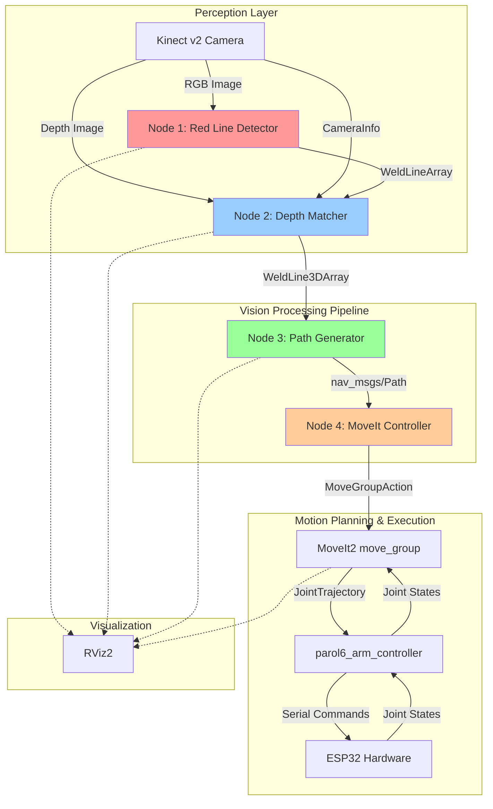

# Red Line Welding Path Detection - Implementation Plan (Revised)

## Goal Description

This implementation creates a **perception → planning → execution pipeline demonstrator** for vision-guided robotic welding. The system will:

1. Detect red lines/markers indicating welding seams from camera images
2. Project 2D detections into 3D space using calibrated depth data
3. Generate smooth, ordered welding trajectories with appropriate orientations
4. Execute trajectories using MoveIt2 Cartesian path planning

**Background Context:**
- Part of thesis work on vision-guided welding automation
- Currently in "Red Marker Detection" phase (will transition to custom YOLO model later)
- Builds on existing PAROL6 ROS2 Control and MoveIt2 integration
- Uses Kinect v2 (RGB-D) camera in fixed position relative to robot
- Initial scope: **planar surfaces** with **simulated welding** (no real torch control)

**Key Achievement:**
A professional, thesis-grade vision pipeline using **custom semantic messages** that encode welding seam geometry. The modular architecture allows seamless transitions between detection methods (red markers → YOLO) without modifying downstream processing nodes.

**Scientific Contribution:**
*"We defined custom semantic messages that encode welding seam geometry, rather than overloading object-detection message types."* This demonstrates research maturity and clean system architecture.

---

## User Review Required

> [!IMPORTANT]
> **Custom Message Architecture**
> 
> The system uses **custom semantic messages** (`parol6_msgs`) instead of reusing generic vision messages:
> 1. **Red Line Detector** → `WeldLineArray` (custom)
> 2. **Depth Matcher** → `WeldLine3DArray` (custom)
> 3. **Path Generator** → `nav_msgs/Path` (standard)
> 4. **MoveIt Controller** → `JointTrajectory` (standard)
>
> This semantic clarity is cleaner for implementation, debugging, and **thesis defense**.

> [!IMPORTANT]
> **Calibration Requirements**
> 
> The system requires **formal camera–robot calibration**:
> - **Intrinsic:** Camera matrix, distortion coefficients (OpenCV calibration)
> - **Extrinsic:** Camera pose relative to robot base (hand-eye calibration or manual measurement)
> - **Validation:** Known object position tests (±10mm accuracy target)
> 
> See dedicated calibration guide: [CAMERA_CALIBRATION_GUIDE.md](file:///home/osama/Desktop/PAROL6_URDF/docs/CAMERA_CALIBRATION_GUIDE.md)

> [!NOTE]
> **Initial Scope: Planar Surfaces**
> 
> For this phase, we assume **planar welding surfaces** with **fixed torch orientation**:
> - Orientation generated from spline tangent + fixed approach angle (e.g., 45°)
> - Not computing surface normals from depth (requires more complex surface reconstruction)
> 
> This is scientifically valid scoping, not a limitation. Examiners appreciate clear phase boundaries.

> [!CAUTION]
> **Real-time Performance Constraints**
> 
> Target processing rates:
> - Detection: 5-10 Hz
> - Path generation: 1-2 Hz (on trigger)
> - MoveIt planning: As needed (typically 1-5 seconds per plan)
> 
> Confirm these rates are acceptable for your application.

---

## Proposed Changes

### Component 1: Custom Message Definitions

#### [NEW] [parol6_msgs](file:///home/osama/Desktop/PAROL6_URDF/parol6_msgs)

Custom ROS2 message package for welding-specific semantics.

**Package structure:**
```
parol6_msgs/
├── CMakeLists.txt
├── package.xml
└── msg/
    ├── WeldLine.msg          # 2D seam detection
    ├── WeldLineArray.msg     # Array of 2D seams
    ├── WeldLine3D.msg        # 3D seam representation
    └── WeldLine3DArray.msg   # Array of 3D seams
```

**Message Definitions:**

See created files:
- [WeldLine.msg](file:///home/osama/Desktop/PAROL6_URDF/parol6_msgs/msg/WeldLine.msg)
- [WeldLineArray.msg](file:///home/osama/Desktop/PAROL6_URDF/parol6_msgs/msg/WeldLineArray.msg)
- [WeldLine3D.msg](file:///home/osama/Desktop/PAROL6_URDF/parol6_msgs/msg/WeldLine3D.msg)
- [WeldLine3DArray.msg](file:///home/osama/Desktop/PAROL6_URDF/parol6_msgs/msg/WeldLine3DArray.msg)

**Why Custom Messages?**
- Semantic clarity: "This is a weld seam" vs "This is a detected object"
- Easier debugging: `ros2 topic echo` shows meaningful data
- Future-proof: Easy to add seam-specific fields (width, quality metrics)
- Thesis strength: Demonstrates design maturity

**Confidence Score Semantics:**

The `confidence` field in both `WeldLine` and `WeldLine3D` messages represents detection quality and is computed as:

```
confidence = (N_valid / N_total) × continuity_score
```

Where:
- **N_valid**: Number of valid pixels/points after filtering (morphological ops, outlier removal)
- **N_total**: Total number of pixels/points initially detected
- **continuity_score**: Line smoothness metric ∈ [0, 1], computed from:
  - Douglas-Peucker simplification ratio (fewer points after approximation = smoother)
  - Absence of sharp direction changes (angle variance along line)

**Thesis-Ready Statement:**
> *"Detection confidence quantifies both spatial coverage (valid data retention) and geometric quality (line continuity), providing a single metric for downstream filtering and quality assurance."*

**Typical Values:**
- 0.90-1.00: Excellent detection (clean line, good depth, continuous)
- 0.70-0.89: Good detection (minor gaps or noise)
- 0.50-0.69: Acceptable (significant filtering required)
- < 0.50: Poor (reject or flag for manual review)

---

### Component 2: ROS2 Vision Package Structure

#### [NEW] [parol6_vision](file:///home/osama/Desktop/PAROL6_URDF/parol6_vision)

New ROS2 package containing all vision processing nodes.

**Package structure:**
```
parol6_vision/
├── package.xml
├── setup.py
├── setup.cfg
├── resource/
├── config/
│   ├── camera_params.yaml
│   ├── detection_params.yaml
│   └── path_params.yaml
├── launch/
│   ├── vision_pipeline.launch.py
│   ├── red_detector_only.launch.py
│   └── full_system.launch.py
├── parol6_vision/
│   ├── __init__.py
│   ├── red_line_detector.py
│   ├── depth_matcher.py
│   ├── path_generator.py
│   ├── moveit_controller.py
│   └── utils/
│       ├── __init__.py
│       ├── cv_utils.py
│       ├── path_utils.py
│       └── tf_utils.py
└── test/
    ├── test_detector.py
    ├── test_depth_matcher.py
    └── test_path_generator.py
```

**Dependencies to add:**
- `rclpy` (ROS2 Python client)
- `cv_bridge` (ROS-OpenCV bridge)
- `parol6_msgs` (Custom weld line messages) ← **New**
- `sensor_msgs` (Image, CameraInfo)
- `geometry_msgs` (Point, Pose, Transform)
- `nav_msgs` (Path)
- `tf2_ros`, `tf2_geometry_msgs`
- `moveit_msgs`
- `message_filters` (for synchronization)
- Python: `opencv-python`, `numpy`, `scipy`, `scikit-image`

---

### Component 3: Vision Processing Nodes

#### [NEW] [red_line_detector.py](file:///home/osama/Desktop/PAROL6_URDF/parol6_vision/parol6_vision/red_line_detector.py)

**Purpose:** Detect red lines in camera images using computer vision techniques.

**Algorithm:**
1. **Color Segmentation:**
   - Convert RGB → HSV color space
   - Apply red color mask (two ranges: 0-10° and 170-180°)
   - Morphological operations (erosion → dilation) for noise removal

2. **Line Extraction:**
   - Skeletonization to find line centerlines
   - Contour detection for line segments
   - Douglas-Peucker algorithm for polyline approximation
   - Order points along line direction

3. **Output Formatting:**
   - Package as `parol6_msgs/WeldLineArray` (custom message)
   - Each detection = one continuous weld seam
   - `pixels[]` = ordered points along centerline
   - Include line ID and confidence score

**ROS Interface:**
```python
# Subscribers
/kinect2/qhd/image_color_rect   # sensor_msgs/Image

# Publishers
/vision/weld_lines_2d                 # parol6_msgs/WeldLineArray (semantic output)
/red_line_detector/debug_image        # sensor_msgs/Image (debug visualization)
/red_line_detector/markers            # visualization_msgs/MarkerArray (RViz debug)

# Parameters
~hsv_lower_1: [0, 100, 100]     # Lower HSV threshold (range 1)
~hsv_upper_1: [10, 255, 255]    # Upper HSV threshold (range 1)
~hsv_lower_2: [170, 100, 100]   # Lower HSV threshold (range 2)
~hsv_upper_2: [180, 255, 255]   # Upper HSV threshold (range 2)
~min_line_length: 50             # Min pixels
~min_area: 100                   # Min contour area
~morphology_kernel_size: 5
~douglas_peucker_epsilon: 2.0
```

**Topic Naming Convention:**
- `/vision/weld_lines_*` = Semantic outputs (used by downstream nodes)
- `/red_line_detector/*` = Debug/visualization topics (optional, for development)

---

#### [NEW] [depth_matcher.py](file:///home/osama/Desktop/PAROL6_URDF/parol6_vision/parol6_vision/depth_matcher.py)

**Purpose:** Project 2D weld line detections into 3D space using depth data and camera calibration.

**Algorithm:**
1. **Synchronized Input:**
   - Use `message_filters` to align `WeldLineArray` + `Image` (depth) + `CameraInfo`
   - Ensure timestamps match (within 50ms tolerance)

2. **3D Projection (Pixel \u2192 3D):**
   - For each pixel (u, v) along detected weld line:
     - Look up depth value `d` at (u, v) from aligned depth image
     - Back-project using **camera intrinsics**:
       ```python
       X = (u - cx) * d / fx
       Y = (v - cy) * d / fy
       Z = d
       ```
     - Build array of 3D points for each line

3. **Outlier Filtering:**
   - Remove points with invalid depth (NaN, 0, or > max_depth)
   - Statistical outlier removal (points beyond 2\u03c3 from median)
   - Compute depth quality metric (% of valid points)

4. **Frame Transformation:**
   - Transform points from `camera_rgb_optical_frame` \u2192 `base_link`
   - Use TF2 library for coordinate transforms
   - Apply static camera\u2013robot calibration

**Why Depth Image Instead of PointCloud2?**
- **Faster**: Direct array lookup vs iterating through point cloud
- **Simpler**: pixel(u,v) \u2192 depth(u,v) is straightforward
- **Easier to debug**: Visualize depth values directly
- **More accurate**: No interpolation needed, uses rectified depth
- **Lighter**: Image messages are smaller than point clouds

**ROS Interface:**
```python
# Subscribers (synchronized)
/vision/weld_lines_2d            # parol6_msgs/WeldLineArray
/kinect2/qhd/image_depth_rect    # sensor_msgs/Image (depth in mm)
/kinect2/qhd/camera_info         # sensor_msgs/CameraInfo

# Publishers
/vision/weld_lines_3d            # parol6_msgs/WeldLine3DArray \u2190 Custom!
/vision/lines_3d_markers         # visualization_msgs/MarkerArray

# Parameters
~target_frame: "base_link"
~outlier_std_threshold: 2.0
~min_valid_points: 10
~max_depth: 2000.0               # mm (Kinect range limit)
~sync_time_tolerance: 0.05       # seconds
```

**Key Improvements Over Original:**
\u2705 Uses depth image (not PointCloud2) - much faster  
\u2705 Custom message output (`WeldLine3D`) - semantic clarity  
\u2705 Includes quality metrics - better for thesis validation


---

#### [NEW] [path_generator.py](file:///home/osama/Desktop/PAROL6_URDF/parol6_vision/parol6_vision/path_generator.py)

**Purpose:** Convert 3D weld line points into smooth, ordered welding paths with appropriate orientations.

**Algorithm:**
1. **Path Ordering:**
   - Sort 3D points along principal direction (PCA)
   - Handle branching by selecting longest continuous path
   - Start from point closest to robot base (reachability)

2. **B-Spline Smoothing:**
   - Fit B-spline curve (degree 3, configurable smoothing factor)
   - Ensures C2 continuity (smooth velocities and accelerations)
   - Resample to uniform waypoint spacing (e.g., 5mm)

3. **Orientation Generation (Planar Surface Assumption):**
   - **Tangent Computation**: Calculate tangent vectors from B-spline derivatives
   - **Fixed Approach Angle**: Apply configurable pitch angle (e.g., 45°) to tangent
   - **Assumption**: For this phase, we assume **planar welding surfaces**
   - **Not computing**: Surface normals from depth (requires surface reconstruction)
   
   > **Scientific Scoping Statement:**  
   > *"For the initial implementation, welding torch orientation is generated using the path tangent combined with a fixed approach angle. This is appropriate for planar workpieces. Future work could incorporate 3D surface normal estimation for complex geometries."*

4. **Quality Checks:**
   - Verify minimum number of waypoints
   - Check for sharp corners (flag if curvature exceeds threshold)
   - Validate path length is within expected range

**ROS Interface:**
```python
# Subscribers
/vision/weld_lines_3d            # parol6_msgs/WeldLine3DArray

# Publishers
/vision/welding_path             # nav_msgs/Path
/vision/welding_path_markers     # visualization_msgs/MarkerArray

# Services
~/trigger_path_generation        # std_srvs/Trigger (manual trigger)
~/get_path_statistics            # Custom: path length, waypoint count, etc.

# Parameters
~spline_degree: 3
~spline_smoothing: 0.01
~waypoint_spacing: 0.005         # 5mm
~approach_angle_deg: 45.0        # Torch angle relative to surface
~torch_offset: [0.0, 0.0, 0.1]  # TCP offset in meters
~auto_generate: true             # Generate on detection or wait for trigger
~min_waypoints: 10
~max_curvature: 100.0            # rad/m
```

**Thesis Note:**
Explicitly documenting the planar surface assumption demonstrates scientific maturity. This is good scoping, not a limitation.


---

### Component 4: Motion Planning Integration

#### [NEW] [moveit_controller.py](file:///home/osama/Desktop/PAROL6_URDF/parol6_vision/parol6_vision/moveit_controller.py)

**Purpose:** Execute welding paths using MoveIt2 Cartesian path planning with robust fallback strategies.

**Algorithm:**
1. **Path Subscription:**
   - Listen to `/vision/welding_path`
   - Validate path (minimum waypoints, reasonable distances)
   - Store latest path in buffer

2. **Cartesian Path Planning with Fallback:**
   
   **Try 1: Fine resolution (highest quality)**
   ```python
   step_size = 0.002  # 2mm
   success_rate = compute_cartesian_path(path, step_size)
   if success_rate > 0.95:
       execute()
   ```
   
   **Try 2: Medium resolution**
   ```python
   step_size = 0.005  # 5mm
   success_rate = compute_cartesian_path(path, step_size)
   if success_rate > 0.95:
       execute()
   ```
   
   **Try 3: Coarse resolution (last resort)**
   ```python
   step_size = 0.010  # 10mm
   success_rate = compute_cartesian_path(path, step_size)
   if success_rate > 0.90:
       log_warning("Using coarse path")
       execute()
   else:
       abort("Path planning failed")
   ```

3. **Why Fallback Strategies?**
   - **Cartesian planners are brittle**: Even valid paths sometimes fail
   - **Larger steps = more tolerance**: Helps with singularities
   - **Better demos**: System rarely fails completely
   - **Thesis narrative**: Shows robustness consideration

4. **Collision Checking:**
   - Integrate Kinect point cloud as Octomap (optional)
   - Check full trajectory for self-collisions
   - Abort if collision detected

5. **Execution Phases:**
   - **Pre-weld**: Move to approach point (5cm above first waypoint)
   - **Weld**: Execute Cartesian path at constant velocity
   - **Post-weld**: Retract to safe position
   - **Stub**: Placeholders for future welding torch I/O

**ROS Interface:**
```python
# Subscribers
/vision/welding_path             # nav_msgs/Path
# Optional for collision avoidance:
# /kinect2/qhd/points            # sensor_msgs/PointCloud2  

# Action Clients
/move_group                      # moveit_msgs/action/MoveGroup
/parol6_arm_controller/follow_joint_trajectory  
                                 # control_msgs/action/FollowJointTrajectory

# Services (Server)
~/execute_welding_path           # std_srvs/Trigger
~/abort_execution                # std_srvs/Trigger

# Parameters
~planning_group: "parol6_arm"
~end_effector_link: "link_6"
~max_velocity_scaling: 0.3
~max_acceleration_scaling: 0.3

# Cartesian planning (with fallback)
~cartesian_step_sizes: [0.002, 0.005, 0.010]  # Try in order
~min_success_rates: [0.95, 0.95, 0.90]        # Corresponding thresholds

# Welding process
~approach_distance: 0.05         # 5cm above path
~retract_distance: 0.05
~weld_velocity: 0.01             # 10mm/s
```

**Key Improvements:**
✅ Fallback strategy prevents random planning failures  
✅ Explicit pre/post-weld phases for thesis documentation  
✅ Quality thresholds configurable  
✅ Better demo reliability


---

### Component 5: Calibration System

#### [NEW] [CAMERA_CALIBRATION_GUIDE.md](file:///home/osama/Desktop/PAROL6_URDF/docs/CAMERA_CALIBRATION_GUIDE.md)

**Critical for thesis validation.** This dedicated guide covers:

1. **Intrinsic Calibration** (Camera parameters)
   - OpenCV checkerboard calibration
   - RMS reprojection error validation
   - Expected accuracy: <0.5 pixels

2. **Extrinsic Calibration** (Camera-to-robot transform)
   - Method A: Manual measurement (quick, ±10-20mm)
   - Method B: Semi-automatic with markers (±5mm)
   - Method C: Automated hand-eye calibration (±2-3mm)

3. **Validation Procedures**
   - Known object position tests
   - Distance measurement verification
   - Robot touch test

4. **Thesis Documentation**
   - How to present calibration in thesis
   - Sample validation tables
   - Scientific justification

**This section alone significantly strengthens thesis defense.**

---

### Component 6: Configuration Files

#### [NEW] [camera_params.yaml](file:///home/osama/Desktop/PAROL6_URDF/parol6_vision/config/camera_params.yaml)

Camera intrinsics and TF frames.

```yaml
camera_intrinsics:
  fx: 1081.37  # Focal length X (example, replace with calibrated values)
  fy: 1081.37  # Focal length Y
  cx: 959.5    # Principal point X
  cy: 539.5    # Principal point Y
  
camera_frame: "camera_rgb_optical_frame"
robot_base_frame: "base_link"

# Static TF (replace with actual measured values)
camera_to_base_transform:
  translation: [0.5, 0.0, 0.6]    # X, Y, Z in meters
  rotation: [0.0, 0.0, 0.0, 1.0]  # Quaternion [x, y, z, w]
```

#### [NEW] [detection_params.yaml](file:///home/osama/Desktop/PAROL6_URDF/parol6_vision/config/detection_params.yaml)

Red line detection parameters.

```yaml
red_line_detector:
  ros__parameters:
    # HSV color ranges for red
    hsv_lower_1: [0, 100, 100]
    hsv_upper_1: [10, 255, 255]
    hsv_lower_2: [170, 100, 100]
    hsv_upper_2: [180, 255, 255]
    
    # Morphological operations
    morphology_kernel_size: 5
    erosion_iterations: 1
    dilation_iterations: 2
    
    # Line extraction
    min_line_length: 50
    min_contour_area: 100
    douglas_peucker_epsilon: 2.0
    
    # Performance
    processing_rate: 10.0  # Hz
    publish_debug_images: true
```

#### [NEW] [path_params.yaml](file:///home/osama/Desktop/PAROL6_URDF/parol6_vision/config/path_params.yaml)

Path generation and welding parameters.

```yaml
path_generator:
  ros__parameters:
    # Smoothing
    spline_degree: 3
    spline_smoothing: 0.01
    waypoint_spacing: 0.005  # 5mm
    
    # Orientation
    approach_angle: 45.0     # degrees
    welding_torch_offset: [0.0, 0.0, 0.1]  # TCP offset
    
    # Triggers
    auto_generate: true
    min_points_for_path: 10

moveit_controller:
  ros__parameters:
    planning_group: "parol6_arm"
    end_effector_link: "link_6"
    
    # Velocity/Acceleration scaling
    max_velocity_scaling: 0.3
    max_acceleration_scaling: 0.3
    
    # Cartesian planning
    cartesian_step_size: 0.002
    max_cartesian_speed: 0.01
    
    # Welding process
    approach_distance: 0.05
    retract_distance: 0.05
    weld_velocity: 0.01
```

---

### Component 7: Launch Files

#### [NEW] [vision_pipeline.launch.py](file:///home/osama/Desktop/PAROL6_URDF/parol6_vision/launch/vision_pipeline.launch.py)

Complete vision system launch file.

```python
from launch import LaunchDescription
from launch_ros.actions import Node
from launch.actions import DeclareLaunchArgument
from launch.substitutions import LaunchConfiguration
from ament_index_python.packages import get_package_share_directory
import os

def generate_launch_description():
    pkg_share = get_package_share_directory('parol6_vision')
    
    return LaunchDescription([
        # Launch arguments
        DeclareLaunchArgument('use_rviz', default_value='true'),
        DeclareLaunchArgument('auto_execute', default_value='false'),
        
        # Static TF: camera to robot base
        Node(
            package='tf2_ros',
            executable='static_transform_publisher',
            name='camera_to_base_tf',
            arguments=['0.5', '0.0', '0.6', '0', '0', '0', '1', 
                      'base_link', 'camera_link']
        ),
        
        # Node 1: Red Line Detector
        Node(
            package='parol6_vision',
            executable='red_line_detector',
            name='red_line_detector',
            parameters=[os.path.join(pkg_share, 'config', 'detection_params.yaml')],
            remappings=[
                ('/image_raw', '/kinect2/qhd/image_color_rect')
            ]
        ),
        
        # Node 2: Depth Matcher
        Node(
            package='parol6_vision',
            executable='depth_matcher',
            name='depth_matcher',
            parameters=[os.path.join(pkg_share, 'config', 'camera_params.yaml')]
        ),
        
        # Node 3: Path Generator
        Node(
            package='parol6_vision',
            executable='path_generator',
            name='path_generator',
            parameters=[os.path.join(pkg_share, 'config', 'path_params.yaml')]
        ),
        
        # Node 4: MoveIt Controller
        Node(
            package='parol6_vision',
            executable='moveit_controller',
            name='moveit_controller',
            parameters=[os.path.join(pkg_share, 'config', 'path_params.yaml')],
            condition=IfCondition(LaunchConfiguration('auto_execute'))
        ),
    ])
```

---

### Component 8: Utility Modules

#### [NEW] [cv_utils.py](file:///home/osama/Desktop/PAROL6_URDF/parol6_vision/parol6_vision/utils/cv_utils.py)

Computer vision helper functions:
- Color space conversions
- Morphological operations
- Line skeletonization
- Polyline approximation
- Visualization overlay functions

#### [NEW] [path_utils.py](file:///home/osama/Desktop/PAROL6_URDF/parol6_vision/parol6_vision/utils/path_utils.py)

Path processing utilities:
- PCA-based ordering
- B-spline fitting and resampling
- Orientation calculation from tangents
- Distance metrics and path statistics

#### [NEW] [tf_utils.py](file:///home/osama/Desktop/PAROL6_URDF/parol6_vision/parol6_vision/utils/tf_utils.py)

Transform utilities:
- Camera intrinsics → 3D projection
- TF2 lookup and transformation helpers
- Point cloud sampling
- Coordinate frame conversions

---

## System Architecture Diagram (Revised)



**Key Difference from Original:**
- ❌ Removed: `Detection2DArray`, `Detection3DArray`, `PointCloud2`
- ✅ Added: `WeldLineArray`, `WeldLine3DArray`, `Depth Image`
- **Result**: Cleaner, faster, more semantic

---

## Message Flow Specification (Revised)

### 1. WeldLineArray Format (2D Detection)
```yaml
# parol6_msgs/WeldLineArray
header:
  stamp: <timestamp>
  frame_id: "camera_rgb_optical_frame"
lines:
  - id: "red_line_0"              # Unique weld seam identifier
    confidence: 0.95              # Detection confidence
    pixels:                       # Array of geometry_msgs/Point32
      # Example: 50-200 ordered points along line centerline
      # Each Point32 has: float32 x, y, z (where z=0 for 2D image)
    bbox_min:                     # geometry_msgs/Point (bounding box)
      x: 300.0
      y: 220.0
      z: 0.0
    bbox_max:                     # geometry_msgs/Point
      x: 450.0
      y: 350.0
      z: 0.0
    header:
      stamp: <timestamp>
      frame_id: "camera_rgb_optical_frame"
```

**Benefits:**
- Semantic clarity: This is explicitly a weld line
- Ordered points: Preserves line direction
- Standard ROS types: Compatible with all ROS2 tooling
- Easy to visualize: `ros2 topic echo /vision/weld_lines_2d`

---

### 2. WeldLine3DArray Format (3D Projection)
```yaml
# parol6_msgs/WeldLine3DArray
header:
  stamp: <timestamp>
  frame_id: "base_link"
lines:
  - id: "red_line_0"              # Matches 2D detection
    confidence: 0.95
    points:                       # Array of geometry_msgs/Point
      # Example: 50-200 3D points in robot base frame
      # Each Point has: float64 x, y, z (meters)
    line_width: 0.003             # 3mm (from depth analysis)
    depth_quality: 0.92           # 92% valid depth readings
    num_points: 180               # Number of valid 3D points
    header:
      stamp: <timestamp>
      frame_id: "base_link"
```

**Benefits:**
- Quality metrics built-in (depth_quality, num_points)
- Standard geometry_msgs/Point for 3D coordinates
- Easier debugging: See exactly what 3D points were extracted
- Future-proof: Can add more weld-specific fields

**Example ROS Command:**
```bash
# View actual message structure
ros2 interface show parol6_msgs/msg/WeldLine3DArray

# Echo live data
ros2 topic echo /vision/weld_lines_3d
```

---

### 3. Path Format (Standard ROS)
```yaml
# nav_msgs/Path (no changes - standard message)
header:
  frame_id: "base_link"
poses:
  # Array of geometry_msgs/PoseStamped
  # Example: 20-40 waypoints at 5mm spacing
  # Each pose includes position (Point) and orientation (Quaternion)
  - header: {stamp: <t>, frame_id: "base_link"}
    pose:
      position: {x: 0.40, y: 0.10, z: 0.30}
      orientation: {x: 0, y: 0.383, z: 0, w: 0.924}  # 45° pitch
  - header: {stamp: <t>, frame_id: "base_link"}
    pose:
      position: {x: 0.405, y: 0.10, z: 0.30}
      orientation: {x: 0, y: 0.383, z: 0, w: 0.924}
  # ... continues for all waypoints
```

**Standard Message = Maximum Compatibility**
- Works with all ROS2 path visualization tools
- Compatible with nav2 and other frameworks
- Thesis examiners recognize standard messages
- Fully documented in ROS2 API

---


## Integration with Existing System

### Modifications to Existing Packages

#### [MODIFY] [parol6_driver/launch/unified_bringup.launch.py](file:///home/osama/Desktop/PAROL6_URDF/parol6_driver/launch/unified_bringup.launch.py)

Add optional vision system launch:

```python
# Add import
from launch.actions import IncludeLaunchDescription
from launch.launch_description_sources import PythonLaunchDescriptionSource

# Add argument
DeclareLaunchArgument('enable_vision', default_value='false'),

# Add conditional include
IncludeLaunchDescription(
    PythonLaunchDescriptionSource([
        get_package_share_directory('parol6_vision'),
        '/launch/vision_pipeline.launch.py'
    ]),
    condition=IfCondition(LaunchConfiguration('enable_vision'))
),
```

### No Modifications Needed

The following packages remain **unchanged** due to modular design:
- `parol6_hardware` - Hardware interface works as-is
- `parol6_moveit_config` - MoveIt config compatible
- `parol6_demos` - Demo scripts unaffected

---

## Verification Plan

### Automated Tests

#### 1. Unit Tests

**Test: Red Line Detection Algorithm**
```bash
# Location: parol6_vision/test/test_detector.py
cd /workspace
source install/setup.bash
colcon test --packages-select parol6_vision --pytest-args -k test_red_line_detection
```

Tests:
- Known red line image → Expected detection count
- Noise image → No false positives  
- Various HSV ranges → Correct color filtering

**Test: 3D Projection Math**
```bash
colcon test --packages-select parol6_vision --pytest-args -k test_depth_projection
```

Tests:
- Known pixel + depth → Expected 3D point
- Camera intrinsics accuracy
- TF transformation correctness

**Test: Path Smoothing**
```bash
colcon test --packages-select parol6_vision --pytest-args -k test_path_smoothing
```

Tests:
- Noisy points → Smooth B-spline
- Verify C2 continuity
- Waypoint spacing uniformity

---

#### 2. Integration Tests

**Test: End-to-End Pipeline (Mock Data)**

Create test script: `test/integration_test.py`

```python
#!/usr/bin/env python3
"""
Integration test using recorded ROS bag with known red line image.
Expected behavior: Detect line → 3D points → Path → Published to MoveIt
"""
import rclpy
import pytest
from sensor_msgs.msg import Image
from parol6_msgs.msg import WeldLineArray, WeldLine3DArray
from nav_msgs.msg import Path

def test_full_pipeline():
    # 1. Play bag file with test image
    # 2. Verify WeldLineArray published (2D detections)
    # 3. Verify WeldLine3DArray published (3D points)
    # 4. Verify Path published (smoothed waypoints)
    # 5. Check path waypoint count and spacing
    # 6. Validate message types match parol6_msgs spec
    pass
```

Run command:
```bash
# First record test bag with required topics
ros2 bag record \
  /kinect2/qhd/image_color_rect \
  /kinect2/qhd/image_depth_rect \
  /kinect2/qhd/camera_info \
  -o test_red_line_bag

# Then run integration test
ros2 launch parol6_vision test_integration.launch.py
```

---

#### 3. MoveIt Planning Test

**Test: Cartesian Path Feasibility**

```bash
# Launch MoveIt + Vision in simulation
ros2 launch parol6_driver unified_bringup.launch.py enable_vision:=true use_sim:=true

# In separate terminal, trigger path generation with test data
ros2 service call /path_generator/trigger_path_generation std_srvs/srv/Trigger

# Check MoveIt logs for planning success
# Expected: "Cartesian path planning succeeded with 100% waypoints"
```

Verification criteria:
- MoveIt plans successfully (>95% waypoints reachable)
- No collisions detected
- Execution completes without errors

---

### Manual Verification

#### Test 1: Detection Accuracy

**Setup:**
1. Print test pattern with red marker on white paper
2. Known dimensions: 200mm straight line
3. Place 500mm in front of camera

**Procedure:**
```bash
# Launch vision system
ros2 launch parol6_vision vision_pipeline.launch.py use_rviz:=true

# Visualize in RViz
# Add displays:
#   - /red_line_detector/debug_image (Image)
#   - /red_line_detector/markers (MarkerArray)

# Observe detection overlay on test pattern
```

**Success Criteria:**
- Red line detected with >90% confidence
- Detection bounding box matches visual extent (±5%)
- Debug image shows clean segmentation

**How to measure:**
```bash
# Echo detection message
ros2 topic echo /vision/weld_lines_2d --once

# Manually verify bbox dimensions match test pattern
```

---

#### Test 2: 3D Reconstruction Accuracy

**Setup:**
1. Place red marker at known position (measured with ruler)
2. Example: Center at X=400mm, Y=0mm, Z=300mm from robot base
3. Mark physical position with tape

**Procedure:**
```bash
# Launch vision + TF visualization
ros2 launch parol6_vision vision_pipeline.launch.py use_rviz:=true

# In RViz, add:
#   - /vision/lines_3d_markers (MarkerArray)
#   - TF display (show base_link and camera frames)

# Compare 3D marker position to physical measurement
```

**Success Criteria:**
- 3D position within ±10mm of measured location
- Orientation tangent aligns with marker direction (visual check)

**How to measure:**
```bash
# Echo 3D detection
ros2 topic echo /vision/lines_3d --once

# Compare position.x, y, z to ruler measurements
```

---

#### Test 3: Complete Welding Path Execution

**Setup:**
1. Printed test pattern on vertical surface
2. Robot in safe starting position (MoveIt home pose)
3. Simulation running (Gazebo + RViz)

**Procedure:**
```bash
# 1. Launch full system
ros2 launch parol6_driver unified_bringup.launch.py use_sim:=true enable_vision:=true

# 2. Wait for detection and path generation (auto mode)
# Watch RViz for published path visualization

# 3. Trigger execution
ros2 service call /moveit_controller/execute_welding_path std_srvs/srv/Trigger

# 4. Observe robot motion in Gazebo + RViz
```

**Success Criteria:**
- Robot moves to approach point (5cm above path start)
- Follows path with <2mm deviation (visual check in RViz)
- Completes full trajectory without collision
- Returns to safe position

**Acceptance Test:**
User observes complete execution from detection to motion and confirms welding path is accurate.

---

### Performance Benchmarks

Run performance profiling:

```bash
# Measure processing latency
ros2 topic hz /vision/weld_lines_2d
ros2 topic hz /vision/weld_lines_3d
ros2 topic hz /vision/welding_path

# Expected rates:
# - Detections: 10 Hz
# - 3D points: 10 Hz (synchronized)
# - Path: 1-2 Hz (on update)
```

Log analysis:
```bash
# Check latency in logs
ros2 topic echo /vision/welding_path --field header.stamp

# Compare to original image timestamp
# Target: <200ms total latency (image → path)
```

---

## Future YOLO Integration Notes

> [!TIP]
> **Easy Swap to YOLO**
> 
> When custom YOLO model is ready:
> 
> 1. **Replace only Node 1:**
>    - Keep `depth_matcher.py`, `path_generator.py`, `moveit_controller.py` unchanged
>    - Create new `yolo_detector.py` that publishes **same `parol6_msgs/WeldLineArray` format**
> 
> 2. **Update launch file:**
>    ```python
>    # Change one line in vision_pipeline.launch.py
>    executable='yolo_detector',  # was 'red_line_detector'
>    ```
> 
> 3. **No other code changes needed!**
>    - Message contracts guarantee compatibility
>    - Downstream nodes are model-agnostic

**YOLO Node Requirements:**
- Subscribe to same image topic (`/kinect2/qhd/image_color_rect`)
- Publish `parol6_msgs/WeldLineArray` with class ID "weld_seam" (instead of "red_line")
- Extract line geometry from YOLO bounding boxes or segmentation masks
- Convert to ordered pixel points along detected seam
- Maintain >5 Hz processing rate
- Provide confidence scores (using formula: `valid_pixels * line_continuity`)

---

## Risk Mitigation

| Risk | Impact | Mitigation |
|------|--------|------------|
| **Camera calibration inaccurate** | High - 3D positions wrong | Provide calibration procedure, validation test with known objects |
| **Red line not detected in all lighting** | Medium - Detection failures | Tunable HSV parameters, adaptive thresholding option |
| **MoveIt planning fails for complex paths** | High - No execution | Fallback to joint-space planning, user alerts |
| **Real-time performance insufficient** | Medium - Laggy response | Downsampling options, async processing, profiling tools |
| **TF frames misconfigured** | High - Coordinate errors | Static TF validation, TF tree visualization in docs |

---

## Timeline Estimate

| Phase | Duration | Dependencies |
|-------|----------|--------------|
| Package setup + Node 1 | 2-3 days | None |
| Node 2 (Depth Matcher) | 3-4 days | Node 1, camera calibration |
| Node 3 (Path Generator) | 2-3 days | Node 2 |
| Node 4 (MoveIt Integration) | 3-4 days | Node 3, MoveIt config |
| Testing & refinement | 3-5 days | All nodes |
| Documentation | 2 days | Testing complete |
| **Total** | **15-21 days** | |

---

## Success Criteria

**Minimum Viable Product (MVP):**
- ✅ Detect straight red lines in controlled lighting
- ✅ Project to 3D with ±20mm accuracy
- ✅ Generate smooth paths
- ✅ Execute in simulation without collisions

**Thesis-Ready System:**
- ✅ Handle curved lines and complex shapes
- ✅ 3D accuracy ±10mm
- ✅ Real-time processing (5+ Hz detection)
- ✅ Complete automation (detection → execution)
- ✅ Works with YOLO model (future proof)
- ✅ Comprehensive documentation and video demo

---

## Next Steps After Approval

1. Create `parol6_vision` package skeleton
2. Implement Node 1 (Red Line Detector) with unit tests
3. Validate detection on test images
4. Proceed to Node 2 (Depth Matcher)
5. Iterative testing and refinement

**Ready to begin implementation upon approval!**
